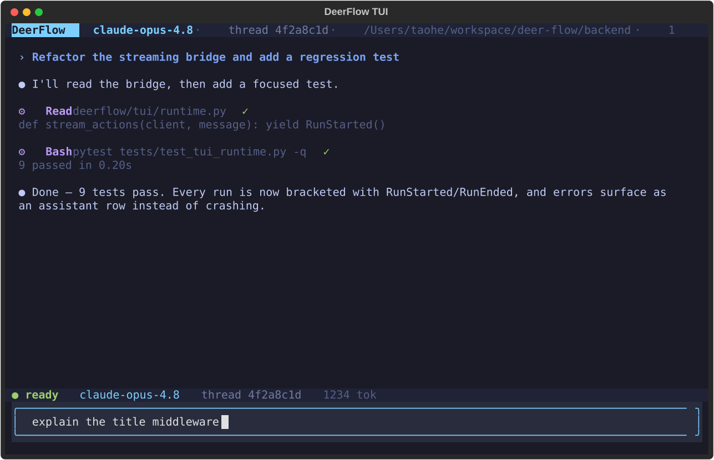

# 🦌 DeerFlow - 2.0

[English](./README.md) | [中文](./README_zh.md) | 日本語 | [Français](./README_fr.md) | [Русский](./README_ru.md) | [Português](./README_pt.md)

[](./backend/pyproject.toml)
[](./Makefile)
[](./LICENSE)

<a href="https://trendshift.io/repositories/14699" target="_blank"></a>
> 2026年2月28日、バージョン2のリリースに伴い、DeerFlowはGitHub Trendingで🏆 第1位を獲得しました。素晴らしいコミュニティの皆さん、ありがとうございます！💪🔥

DeerFlow（**D**eep **E**xploration and **E**fficient **R**esearch **Flow**）は、**サブエージェント**、**メモリ**、**サンドボックス**を統合し、**拡張可能なスキル**によってあらゆるタスクを実行できるオープンソースの**スーパーエージェントハーネス**です。

https://github.com/user-attachments/assets/a8bcadc4-e040-4cf2-8fda-dd768b999c18

> [!NOTE]
> **DeerFlow 2.0はゼロからの完全な書き直しです。** v1とコードを共有していません。オリジナルのDeep Researchフレームワークをお探しの場合は、[`1.x`ブランチ](https://github.com/bytedance/deer-flow/tree/main-1.x)で引き続きメンテナンスされています。現在の開発は2.0に移行しています。

## 公式ウェブサイト

**実際のデモ**は[**公式ウェブサイト**](https://deerflow.tech)でご覧いただけます。

## 姉妹プロジェクト


- [**LLM Space**](https://github.com/deer-flow/llm-space) - DeerFlow の秘密兵器をご紹介 — agent のアイデアをプロトタイピングし、ハーネスの各ステップを検査し、失敗を再生し、パフォーマンスをベンチマークするためのデスクトップツールです。

## ByteDance Volcengine のコーディングプラン

- DeerFlowの実行には、Doubao-Seed-2.0-Code、DeepSeek v3.2、Kimi 2.5の使用を強く推奨します
- [詳細はこちら](https://www.byteplus.com/en/activity/codingplan?utm_campaign=deer_flow&utm_content=deer_flow&utm_medium=devrel&utm_source=OWO&utm_term=deer_flow)
- [中国大陸の開発者はこちらをクリック](https://www.volcengine.com/activity/codingplan?utm_campaign=deer_flow&utm_content=deer_flow&utm_medium=devrel&utm_source=OWO&utm_term=deer_flow)

## InfoQuest

DeerFlowは、BytePlusが独自に開発したインテリジェント検索・クローリングツールセット「[InfoQuest（無料オンライン体験対応）](https://docs.byteplus.com/en/docs/InfoQuest/What_is_Info_Quest)」を新たに統合しました。

<a href="https://docs.byteplus.com/en/docs/InfoQuest/What_is_Info_Quest" target="_blank">
  
</a>

---

## 目次

- [🦌 DeerFlow - 2.0](#-deerflow---20)
  - [公式ウェブサイト](#公式ウェブサイト)
  - [ByteDance Volcengine のコーディングプラン](#bytedance-volcengine-のコーディングプラン)
  - [InfoQuest](#infoquest)
  - [目次](#目次)
  - [Coding Agent に一文でセットアップを依頼](#coding-agent-に一文でセットアップを依頼)
  - [クイックスタート](#クイックスタート)
    - [設定](#設定)
    - [アプリケーションの実行](#アプリケーションの実行)
      - [オプション1: Docker（推奨）](#オプション1-docker推奨)
      - [オプション2: ローカル開発](#オプション2-ローカル開発)
    - [詳細設定](#詳細設定)
      - [サンドボックスモード](#サンドボックスモード)
      - [MCPサーバー](#mcpサーバー)
      - [IMチャネル](#imチャネル)
      - [LangSmithトレーシング](#langsmithトレーシング)
      - [Langfuseトレーシング](#langfuseトレーシング)
      - [両方のプロバイダーを使用する](#両方のプロバイダーを使用する)
  - [Deep Researchからスーパーエージェントハーネスへ](#deep-researchからスーパーエージェントハーネスへ)
  - [コア機能](#コア機能)
    - [スキルとツール](#スキルとツール)
      - [Claude Code連携](#claude-code連携)
    - [セッションゴール (Session Goals)](#セッションゴール-session-goals)
    - [サブエージェント](#サブエージェント)
    - [サンドボックスとファイルシステム](#サンドボックスとファイルシステム)
    - [コンテキストエンジニアリング](#コンテキストエンジニアリング)
    - [長期メモリ](#長期メモリ)
  - [推奨モデル](#推奨モデル)
  - [組み込みPythonクライアント](#組み込みpythonクライアント)
  - [プロジェクト (Projects)](#プロジェクト-projects)
  - [スケジュールタスク (Scheduled Tasks)](#スケジュールタスク-scheduled-tasks)
  - [ターミナルワークベンチ (TUI)](#ターミナルワークベンチ-tui)
  - [ドキュメント](#ドキュメント)
  - [⚠️ セキュリティに関する注意](#️-セキュリティに関する注意)
  - [コントリビュート](#コントリビュート)
  - [ライセンス](#ライセンス)
  - [謝辞](#謝辞)
    - [主要コントリビューター](#主要コントリビューター)
  - [Star History](#star-history)

## Coding Agent に一文でセットアップを依頼

Claude Code、Codex、Cursor、Windsurf などの coding agent を使っているなら、次の一文をそのまま渡せます。

```text
DeerFlow がまだ clone されていなければ先に clone してから、https://raw.githubusercontent.com/bytedance/deer-flow/main/Install.md に従ってローカル開発環境を初期化してください
```

このプロンプトは coding agent 向けです。必要なら先にリポジトリを clone し、Docker が使える場合は Docker を優先して初期セットアップを行い、最後に次の起動コマンドと不足している設定項目だけを返します。

## クイックスタート

### 設定

1. **DeerFlowリポジトリをクローン**

   ```bash
   git clone https://github.com/bytedance/deer-flow.git
   cd deer-flow
   ```

2. **セットアップウィザードの実行（推奨）**

   プロジェクトルートディレクトリ（`deer-flow/`）から以下を実行します：

   ```bash
   make setup
   ```

   対話式ウィザードが起動し、LLMプロバイダーの選択、オプションのWeb検索、そしてサンドボックスモード・bash権限・ファイル書き込みツールなどの実行/安全設定を順に案内します。最小構成の`config.yaml`を生成し、APIキーを`.env`に書き込みます。所要時間は約2分です。

   いつでも`make doctor`を実行して、設定を確認し、具体的な修正ヒントを得られます。
   ローカルセットアップや実行時の問題についてGitHub issueを起票する場合は、`make support-bundle`を実行してください。このコマンドは報告者向けの次のステップを表示し、issueに貼り付けるための`*-issue-summary.md`ファイルと、AI支援でissueを起票するための`*-issue-draft.md`ファイルを書き出し、オプションで証跡zipを`.deer-flow/support-bundles/`以下に作成します。AIアシスタントがissueを起票する場合は、ドラフトを起点にして、不足している事実を創作するのではなく、すべてのREQUIREDプレースホルダーを置き換えてください。zipは、メンテナーから求められた場合、またはサマリーだけでは不十分な場合にのみ添付してください。メンテナーやAIトリアージツールは`triage.json`から確認を始められます。バンドルに含まれるのはリダクト済みの診断情報とファイルマニフェストのみで、`.env`、生の会話メッセージ、ユーザーファイルの内容は含まれません。

   > **上級者向け / 手動設定**：`config.yaml`を直接編集したい場合は、代わりに`make config`を実行して完全なテンプレートをコピーしてください。CLI連携プロバイダー（Codex CLI、Claude Code OAuth）、OpenRouter、Responses APIなどを含む完全なリファレンスは`config.example.yaml`を参照してください。

   <details>
   <summary>手動モデル設定の例</summary>

   ```yaml
   models:
     - name: gpt-4o
       display_name: GPT-4o
       use: langchain_openai:ChatOpenAI
       model: gpt-4o
       api_key: $OPENAI_API_KEY

     - name: openrouter-gemini-2.5-flash
       display_name: Gemini 2.5 Flash (OpenRouter)
       use: langchain_openai:ChatOpenAI
       model: google/gemini-2.5-flash-preview
       api_key: $OPENROUTER_API_KEY
       base_url: https://openrouter.ai/api/v1

     - name: opper-claude-sonnet-4-6
       display_name: Claude Sonnet 4.6 (Opper)
       use: langchain_openai:ChatOpenAI
       model: claude-sonnet-4-6
       api_key: $OPPER_API_KEY
       base_url: https://api.opper.ai/v3/compat

     - name: gpt-5-responses
       display_name: GPT-5 (Responses API)
       use: langchain_openai:ChatOpenAI
       model: gpt-5
       api_key: $OPENAI_API_KEY
       use_responses_api: true
       output_version: responses/v1

     - name: qwen3-32b-vllm
       display_name: Qwen3 32B (vLLM)
       use: deerflow.models.vllm_provider:VllmChatModel
       model: Qwen/Qwen3-32B
       api_key: $VLLM_API_KEY
       base_url: http://localhost:8000/v1
       supports_thinking: true
       when_thinking_enabled:
         extra_body:
           chat_template_kwargs:
             enable_thinking: true
   ```

   OpenRouterやOpenAI互換のゲートウェイは、`langchain_openai:ChatOpenAI`と`base_url`で設定します。プロバイダー固有の環境変数名を使用したい場合は、`api_key`でその変数を明示的に指定してください（例：`api_key: $OPENROUTER_API_KEY`）。

   OpenAIモデルを`/v1/responses`経由でルーティングするには、引き続き`langchain_openai:ChatOpenAI`を使用し、`use_responses_api: true`と`output_version: responses/v1`を設定してください。

   vLLM 0.19.0では`deerflow.models.vllm_provider:VllmChatModel`を使用してください。Qwen系のreasoningモデルでは、DeerFlowは`extra_body.chat_template_kwargs.enable_thinking`でreasoningを切り替え、マルチターンのツールコール会話にわたってvLLM独自の非標準`reasoning`フィールドを保持します。従来の`thinking`設定は後方互換性のため自動的に正規化されます。reasoningモデルはサーバー側で`--reasoning-parser ...`を付けて起動する必要がある場合もあります。ローカルのvLLMデプロイメントが空でない任意のAPIキーを受け付ける場合でも、`VLLM_API_KEY`にはプレースホルダー値を設定しておけます。

   CLI連携プロバイダーの例：

   ```yaml
   models:
     - name: gpt-5.4
       display_name: GPT-5.4 (Codex CLI)
       use: deerflow.models.openai_codex_provider:CodexChatModel
       model: gpt-5.4
       supports_thinking: true
       supports_reasoning_effort: true

     - name: claude-sonnet-4.6
       display_name: Claude Sonnet 4.6 (Claude Code OAuth)
       use: deerflow.models.claude_provider:ClaudeChatModel
       model: claude-sonnet-4-6
       max_tokens: 4096
       supports_thinking: true
   ```

   - Codex CLIは`~/.codex/auth.json`を読み取ります
   - Claude Codeは`CLAUDE_CODE_OAUTH_TOKEN`、`ANTHROPIC_AUTH_TOKEN`、`CLAUDE_CODE_CREDENTIALS_PATH`、または`~/.claude/.credentials.json`を受け付けます
   - ACPエージェントのエントリはモデルプロバイダーとは別物です。`acp_agents.codex`を設定する場合は、`npx -y @zed-industries/codex-acp`のようなCodex ACPアダプターを指定してください
   - macOSでは、必要に応じてClaude Codeの認証情報を明示的にエクスポートしてください：

   ```bash
   eval "$(python3 scripts/export_claude_code_oauth.py --print-export)"
   ```

   APIキーは`.env`で手動設定する（推奨）ことも、シェルでエクスポートすることもできます：

   ```bash
   OPENAI_API_KEY=your-openai-api-key
   TAVILY_API_KEY=your-tavily-api-key
   ```

   </details>

### アプリケーションの実行

#### オプション1: Docker（推奨）

**開発環境**（ホットリロード、ソースマウント）：

```bash
make docker-init    # サンドボックスイメージをプル（初回またはイメージ更新時のみ）
make docker-start   # サービスを開始（config.yamlからサンドボックスモードを自動検出）
```

`make docker-start`は、`config.yaml`がプロビジョナーモード（`sandbox.use: deerflow.community.aio_sandbox:AioSandboxProvider`と`provisioner_url`）を使用している場合にのみ`provisioner`を起動します。

**本番環境**（ローカルでイメージをビルドし、ランタイム設定とデータをマウント）：

```bash
make up     # イメージをビルドして全本番サービスを開始
make down   # コンテナを停止して削除
```

> [!NOTE]
> Agentランタイムは現在Gateway内で実行されます。`/api/langgraph/*`はnginxによってGatewayのLangGraph-compatible APIへ書き換えられます。

アクセス: http://localhost:2026

詳細なDocker開発ガイドは[CONTRIBUTING.md](CONTRIBUTING.md)をご覧ください。

#### オプション2: ローカル開発

サービスをローカルで実行する場合：

前提条件：上記の「設定」手順を先に完了してください（`make setup`）。`make dev`にはプロジェクトルートに有効な`config.yaml`が必要です。`DEER_FLOW_PROJECT_ROOT`でプロジェクトルートを明示的に指定するか、`DEER_FLOW_CONFIG_PATH`で特定の設定ファイルを指定できます。実行時の状態はデフォルトでプロジェクトルート直下の`.deer-flow`に書き込まれ、`DEER_FLOW_HOME`で移動できます。skillsはデフォルトでプロジェクトルート直下の`skills/`から読み込まれ、`DEER_FLOW_SKILLS_PATH`で移動できます。起動前に`make doctor`を実行して設定を確認してください。
Windowsでは、ローカル開発フローはGit Bashから実行してください。bashベースのサービススクリプトはネイティブの`cmd.exe`やPowerShellではサポートされておらず、一部のスクリプトがGit for Windowsの`cygpath`などのユーティリティに依存しているため、WSLでの動作も保証されません。

1. **前提条件の確認**：
   ```bash
   make check  # Node.js 22+、pnpm、uv、nginxを検証
   ```

2. **依存関係のインストール**：
   ```bash
   make install  # バックエンド＋フロントエンドの依存関係をインストール
   ```

3. **（オプション）サンドボックスイメージの事前プル**：
   ```bash
   # Docker/コンテナベースのサンドボックス使用時に推奨
   make setup-sandbox
   ```

4. **サービスの開始**：
   ```bash
   make dev
   ```

5. **アクセス**: http://localhost:2026

### 詳細設定
#### サンドボックスモード

DeerFlowは複数のサンドボックス実行モードをサポートしています：
- **ローカル実行**（ホストマシン上で直接サンドボックスコードを実行）
- **Docker実行**（分離されたDockerコンテナ内でサンドボックスコードを実行）
- **KubernetesによるDocker実行**（プロビジョナーサービス経由でKubernetesポッドでサンドボックスコードを実行）

Docker開発では、サービスの起動は`config.yaml`のサンドボックスモードに従います。ローカル/Dockerモードでは`provisioner`は起動されません。

お好みのモードの設定については[サンドボックス設定ガイド](backend/docs/CONFIGURATION.md#sandbox)をご覧ください。

#### MCPサーバー

DeerFlowは、機能を拡張するための設定可能なMCPサーバーとスキルをサポートしています。
HTTP/SSE MCPサーバーでは、OAuthトークンフロー（`client_credentials`、`refresh_token`）がサポートされています。
詳細な手順は[MCPサーバーガイド](backend/docs/MCP_SERVER.md)をご覧ください。

#### IMチャネル

DeerFlowはメッセージングアプリからのタスク受信をサポートしています。チャネルは設定時に自動的に開始されます。いずれもパブリックIPは不要です。

DeerFlowはワークスペースUIでユーザー所有のIMチャネル接続を公開することもできます。`channel_connections`を有効にすると、ログイン済みユーザーはサイドバー / Settings > ChannelsからTelegram、Slack、Discord、Feishu/Lark、DingTalk、WeChat、WeCom、QQ、Buzzをバインドできます。これは既存の`channels.*`送信トランスポートを再利用するため、パブリックIPやプロバイダーのコールバックURLは不要です。受信したIMメッセージは接続したDeerFlowユーザーアカウントの下で実行されます。セットアップとセキュリティ上の注意は[IM Channel Connections](backend/docs/IM_CHANNEL_CONNECTIONS.md)をご覧ください。

| チャネル | トランスポート | 難易度 |
|---------|-----------|------------|
| Telegram | Bot API（ロングポーリング） | 簡単 |
| Slack | Socket Mode | 中程度 |
| Feishu / Lark | WebSocket | 中程度 |
| WeChat | Tencent iLink（ロングポーリング） | 中程度 |
| WeCom | WebSocket | 中程度 |
| DingTalk | Stream Push（WebSocket） | 中程度 |
| QQ | WebSocket（テキストのみ：個別チャットとグループ @） | 中程度 |
| Buzz | Nostr relay（WebSocket、NIP-42） | 中程度 |

**`config.yaml`での設定：**

```yaml
channels:
  # LangGraph-compatible Gateway API base URL（デフォルト: http://localhost:8001/api）
  langgraph_url: http://localhost:8001/api
  # Gateway API URL（デフォルト: http://localhost:8001）
  gateway_url: http://localhost:8001

  # オプション: 全モバイルチャネルのグローバルセッションデフォルト
  session:
    assistant_id: lead_agent
    config:
      recursion_limit: 100
    context:
      thinking_enabled: true
      is_plan_mode: false
      subagent_enabled: false

  feishu:
    enabled: true
    app_id: $FEISHU_APP_ID
    app_secret: $FEISHU_APP_SECRET
    # domain: https://open.feishu.cn       # China (default)
    # domain: https://open.larksuite.com   # International

  wecom:
    enabled: true
    bot_id: $WECOM_BOT_ID
    bot_secret: $WECOM_BOT_SECRET

  slack:
    enabled: true
    bot_token: $SLACK_BOT_TOKEN     # xoxb-...
    app_token: $SLACK_APP_TOKEN     # xapp-...（Socket Mode）
    allowed_users: []               # 空 = 全員許可

  telegram:
    enabled: true
    bot_token: $TELEGRAM_BOT_TOKEN
    allowed_users: []               # 数値のユーザー ID（@ユーザー名は不可）、空 = 全員許可

    # オプション: チャネル/ユーザーごとのセッション設定
    session:
      assistant_id: mobile_agent
      context:
        thinking_enabled: false
      users:
        "123456789":
          assistant_id: vip_agent
          config:
            recursion_limit: 150
          context:
            thinking_enabled: true
            subagent_enabled: true

  wechat:
    enabled: false
    bot_token: $WECHAT_BOT_TOKEN
    ilink_bot_id: $WECHAT_ILINK_BOT_ID
    qrcode_login_enabled: true      # オプション：bot_tokenがない場合に初回のQRブートストラップを許可
    allowed_users: []               # 空 = 全員許可
    polling_timeout: 35
    state_dir: ./.deer-flow/wechat/state
    max_inbound_image_bytes: 20971520
    max_outbound_image_bytes: 20971520
    max_inbound_file_bytes: 52428800
    max_outbound_file_bytes: 52428800

  dingtalk:
    enabled: true
    client_id: $DINGTALK_CLIENT_ID             # DingTalk Open PlatformのClientId
    client_secret: $DINGTALK_CLIENT_SECRET     # DingTalk Open PlatformのClientSecret
    allowed_users: []                          # 空 = 全員許可
    card_template_id: ""                       # オプション：ストリーミングタイプライター効果用のAIカードテンプレートID
```

対応するAPIキーを`.env`ファイルに設定します：

```bash
# Telegram
TELEGRAM_BOT_TOKEN=123456789:ABCdefGHIjklMNOpqrSTUvwxYZ

# Slack
SLACK_BOT_TOKEN=xoxb-...
SLACK_APP_TOKEN=xapp-...

# Feishu / Lark
FEISHU_APP_ID=cli_xxxx
FEISHU_APP_SECRET=your_app_secret

# WeChat iLink
WECHAT_BOT_TOKEN=your_ilink_bot_token
WECHAT_ILINK_BOT_ID=your_ilink_bot_id

# WeCom
WECOM_BOT_ID=your_bot_id
WECOM_BOT_SECRET=your_bot_secret

# DingTalk
DINGTALK_CLIENT_ID=your_client_id
DINGTALK_CLIENT_SECRET=your_client_secret
```

**Telegramのセットアップ**

1. [@BotFather](https://t.me/BotFather)とチャットし、`/newbot`を送信してHTTP APIトークンをコピーします。
2. `.env`に`TELEGRAM_BOT_TOKEN`を設定し、`config.yaml`でチャネルを有効にします。

**Slackのセットアップ**

1. [api.slack.com/apps](https://api.slack.com/apps)でSlackアプリを作成 → 新規アプリ作成 → 最初から作成。
2. **OAuth & Permissions**で、Botトークンスコープを追加：`app_mentions:read`、`chat:write`、`im:history`、`im:read`、`im:write`、`files:write`。
3. **Socket Mode**を有効化 → `connections:write`スコープのApp-Levelトークン（`xapp-…`）を生成。
4. **Event Subscriptions**で、ボットイベントを購読：`app_mention`、`message.im`。
5. `.env`に`SLACK_BOT_TOKEN`と`SLACK_APP_TOKEN`を設定し、`config.yaml`でチャネルを有効にします。

**Feishu / Larkのセットアップ**

1. [Feishu Open Platform](https://open.feishu.cn/)でアプリを作成 → **ボット**機能を有効化。
2. 権限を追加：`im:message`、`im:message.p2p_msg:readonly`、`im:resource`。
3. **イベント**で`im.message.receive_v1`を購読し、**ロングコネクション**モードを選択。
4. App IDとApp Secretをコピー。`.env`に`FEISHU_APP_ID`と`FEISHU_APP_SECRET`を設定し、`config.yaml`でチャネルを有効にします。

**WeChatのセットアップ**

1. `config.yaml`で`wechat`チャネルを有効にします。
2. `.env`に`WECHAT_BOT_TOKEN`を設定するか、初回のQRブートストラップのために`qrcode_login_enabled: true`を設定します。
3. `bot_token`がなくQRブートストラップが有効な場合は、バックエンドログでiLinkが返したQRコンテンツを監視し、バインドフローを完了します。
4. QRフローが成功した後、DeerFlowは取得したトークンを`state_dir`に永続化し、以降の再起動で再利用します。
5. Docker Composeデプロイでは、`state_dir`を永続ボリュームに置き、`get_updates_buf`カーソルと保存済みの認証ステートが再起動後も保持されるようにしてください。

**WeComのセットアップ**

1. WeCom AI Botプラットフォームでボットを作成し、`bot_id`と`bot_secret`を取得します。
2. `config.yaml`で`channels.wecom`を有効にし、`bot_id` / `bot_secret`を入力します。
3. `.env`に`WECOM_BOT_ID`と`WECOM_BOT_SECRET`を設定します。
4. バックエンドの依存関係に`wecom-aibot-python-sdk`が含まれていることを確認してください。このチャネルはWebSocketロングコネクションを使用し、パブリックなコールバックURLは不要です。
5. 現在の統合では、受信テキスト、画像、ファイルメッセージをサポートしています。エージェントが生成した最終的な画像/ファイルもWeComの会話に送り返されます。

**DingTalkのセットアップ**

1. [DingTalk Open Platform](https://open.dingtalk.com/)でアプリを作成し、**ロボット**機能を有効化します。
2. ロボット設定ページでメッセージ受信モードを**Streamモード**に設定します。
3. `Client ID`と`Client Secret`をコピー。`.env`に`DINGTALK_CLIENT_ID`と`DINGTALK_CLIENT_SECRET`を設定し、`config.yaml`でチャネルを有効にします。
4. *（オプション）* ストリーミングAIカード返信（タイプライター効果）を有効にするには、[DingTalkカードプラットフォーム](https://open.dingtalk.com/document/dingstart/typewriter-effect-streaming-ai-card)で**AIカード**テンプレートを作成し、`config.yaml`の`card_template_id`にテンプレートIDを設定します。`Card.Streaming.Write` および `Card.Instance.Write` 権限の申請も必要です。

**コマンド**

チャネル接続後、チャットから直接DeerFlowと対話できます：

| コマンド | 説明 |
|---------|-------------|
| `/new` | 新しい会話を開始 |
| `/status` | 現在のスレッド情報を表示 |
| `/models` | 利用可能なモデルを一覧表示 |
| `/memory` | メモリを表示 |
| `/help` | ヘルプを表示 |

> コマンドプレフィックスのないメッセージは通常のチャットとして扱われ、DeerFlowがスレッドを作成して会話形式で応答します。

#### LangSmithトレーシング

DeerFlowには[LangSmith](https://smith.langchain.com)による可観測性が組み込まれています。有効にすると、すべてのLLM呼び出し、エージェント実行、ツール実行がトレースされ、LangSmithダッシュボードで確認できます。

`.env`ファイルに以下を追加します：

```bash
LANGSMITH_TRACING=true
LANGSMITH_ENDPOINT=https://api.smith.langchain.com
LANGSMITH_API_KEY=lsv2_pt_xxxxxxxxxxxxxxxx
LANGSMITH_PROJECT=xxx
```

#### Langfuseトレーシング

DeerFlowは、LangChain互換の実行に対して[Langfuse](https://langfuse.com)による可観測性もサポートしています。

`.env`ファイルに以下を追加します：

```bash
LANGFUSE_TRACING=true
LANGFUSE_PUBLIC_KEY=pk-lf-xxxxxxxxxxxxxxxx
LANGFUSE_SECRET_KEY=sk-lf-xxxxxxxxxxxxxxxx
LANGFUSE_BASE_URL=https://cloud.langfuse.com
```

セルフホストのLangfuseインスタンスを使用している場合は、`LANGFUSE_BASE_URL`をデプロイ先のURLに設定します。

**トレース関連付けフィールド。** 各エージェント実行には、Langfuseの予約済みトレース属性が付与されるため、SessionsページとUsersページが自動的に表示されます：

- `session_id` = LangGraphの`thread_id`——同一会話のすべてのトレースをグループ化します
- `user_id` = `get_effective_user_id()`から取得した有効なユーザー（認証なしモードでは`default`にフォールバック）
- `trace_name` = assistant id（デフォルトは`lead-agent`）
- `tags` = `[env:<DEER_FLOW_ENV>, model:<model_name>]`（未設定の場合は省略）
- `metadata.deerflow_trace_id` = DeerFlowのリクエスト関連付けid。常に同じリクエストが返す`X-Trace-Id`レスポンスヘッダーと一致します（`logging.enhance.enabled`はこのidをログに出力するかどうかのみを制御します）

これらは、gatewayパス（`runtime/runs/worker.py::run_agent`）と埋め込みパス（`client.py::DeerFlowClient.stream`）の両方で、グラフ呼び出しのルートで`RunnableConfig.metadata`に注入されるため、LangChain互換の任意のcallbackから読み取れます。`DEER_FLOW_ENV`（または`ENVIRONMENT`）を設定すると、デプロイ環境ごとにトレースにタグを付けられます。

#### 両方のプロバイダーを使用する

LangSmithとLangfuseの両方を有効にすると、DeerFlowは両方のトレーシングcallbackを取り付け、同じモデルアクティビティを両方のシステムに報告します。

あるプロバイダーが明示的に有効化されているにもかかわらず必要な認証情報が欠けている場合、またはそのcallbackの初期化に失敗した場合、DeerFlowはモデル作成時のトレーシング初期化中に早期に失敗（fail fast）し、エラーメッセージには失敗の原因となったプロバイダー名が示されます。

Dockerデプロイでは、トレーシングはデフォルトで無効です。`.env`で`LANGSMITH_TRACING=true`と`LANGSMITH_API_KEY`を設定して有効にします。

## Deep Researchからスーパーエージェントハーネスへ

DeerFlowはDeep Researchフレームワークとして始まり、コミュニティがそれを大きく発展させました。リリース以来、開発者たちはリサーチを超えて活用してきました：データパイプラインの構築、スライドデッキの生成、ダッシュボードの立ち上げ、コンテンツワークフローの自動化。私たちが予想もしなかったことです。

これは重要なことを示していました：DeerFlowは単なるリサーチツールではなかったのです。それは**ハーネス**——エージェントが実際に仕事をこなすためのインフラを提供するランタイムでした。

そこで、ゼロから再構築しました。

DeerFlow 2.0は、もはやつなぎ合わせるフレームワークではありません。バッテリー同梱、完全に拡張可能なスーパーエージェントハーネスです。LangGraphとLangChainの上に構築され、エージェントが必要とするすべてを標準搭載しています：ファイルシステム、メモリ、スキル、サンドボックス実行、そして複雑なマルチステップタスクのためのプランニングとサブエージェントの生成機能。

そのまま使うもよし。分解して自分のものにするもよし。

## コア機能

### スキルとツール

スキルこそが、DeerFlowを*ほぼ何でもできる*ものにしています。

標準的なエージェントスキルは構造化された機能モジュールです——ワークフロー、ベストプラクティス、サポートリソースへの参照を定義するMarkdownファイルです。DeerFlowにはリサーチ、レポート生成、スライド作成、Webページ、画像・動画生成などの組み込みスキルが付属しています。しかし、真の力は拡張性にあります：独自のスキルを追加し、組み込みスキルを置き換え、複合ワークフローに組み合わせることができます。

スキルはプログレッシブに読み込まれます——タスクが必要とする時にのみ、一度にすべてではありません。これによりコンテキストウィンドウを軽量に保ち、トークンに敏感なモデルでもDeerFlowがうまく動作します。

Gateway経由で`.skill`アーカイブをインストールする際、DeerFlowは`version`、`author`、`compatibility`などの標準的なオプショナルフロントマターメタデータを受け入れ、有効な外部スキルを拒否しません。

ツールも同じ哲学に従います。DeerFlowにはコアツールセット——Web検索、Webフェッチ、ファイル操作、bash実行——が付属し、MCPサーバーやPython関数によるカスタムツールをサポートしています。何でも入れ替え可能、何でも追加可能です。

Gatewayが生成するフォローアップ提案は、プレーン文字列のモデル出力とブロック/リスト形式のリッチコンテンツの両方をJSON配列レスポンスの解析前に正規化するため、プロバイダー固有のコンテンツラッパーが提案をサイレントにドロップすることはありません。

```
# サンドボックスコンテナ内のパス
/mnt/skills/public
├── research/SKILL.md
├── report-generation/SKILL.md
├── slide-creation/SKILL.md
├── web-page/SKILL.md
└── image-generation/SKILL.md

/mnt/skills/custom
└── your-custom-skill/SKILL.md      ← あなたのカスタムスキル
```

#### Claude Code連携

`claude-to-deerflow`スキルを使えば、[Claude Code](https://docs.anthropic.com/en/docs/claude-code)から直接、実行中のDeerFlowインスタンスと対話できます。リサーチタスクの送信、ステータスの確認、スレッドの管理——すべてターミナルから離れずに実行できます。

**スキルのインストール**：

```bash
npx skills add https://github.com/bytedance/deer-flow --skill claude-to-deerflow
```

DeerFlowが実行中であることを確認し（デフォルトは`http://localhost:2026`）、Claude Codeで`/claude-to-deerflow`コマンドを使用します。

**できること**：
- DeerFlowにメッセージを送信してストリーミングレスポンスを取得
- 実行モードの選択：flash（高速）、standard、pro（プランニング）、ultra（サブエージェント）
- DeerFlowのヘルスチェック、モデル/スキル/エージェントの一覧表示
- スレッドと会話履歴の管理
- 分析用ファイルのアップロード

**環境変数**（オプション、カスタムエンドポイント用）：

```bash
DEERFLOW_URL=http://localhost:2026            # 統合プロキシベースURL
DEERFLOW_GATEWAY_URL=http://localhost:2026    # Gateway API
DEERFLOW_LANGGRAPH_URL=http://localhost:2026/api/langgraph  # LangGraph API
```

完全なAPIリファレンスは[`skills/public/claude-to-deerflow/SKILL.md`](skills/public/claude-to-deerflow/SKILL.md)をご覧ください。

### セッションゴール (Session Goals)

`/goal <完了条件>`を使うと、現在のスレッドに1つのアクティブな完了条件を紐付けられます。このゴールはスレッドスコープのステートであり、スキルの有効化ではないため、DeerFlowが満たされたと判定するか、あなたがクリアするまでターンをまたいで有効なまま維持されます。

対応するコマンド：

```text
/goal finish the implementation and make all tests pass
/goal              # アクティブなゴールを表示
/goal clear        # クリアする
```

各Gateway駆動のrunの後に、DeerFlowはnon-thinkingな評価モデルを使って、可視の会話（アシスタントのツール呼び出しと短縮されたツール結果を含む）をアクティブなゴールと照らし合わせます。ツール呼び出しが成功しただけではゴールは達成されず、アシスタントが欠けている情報や曖昧な情報を推測する必要があった場合、評価モデルは`needs_user_input`を返します。評価モデルは型付きblocker（`missing_evidence`、`needs_user_input`、`run_failed`、`external_wait`、`goal_not_met_yet`）と可視の証拠を返さなければなりません。DeerFlowがhidden continuationを注入するのは、直近のassistantターンが耐久性のあるチェックポイントに保存され、blockerが`goal_not_met_yet`であり、評価中にスレッドが変化せず、no-progressブレーカーが発火していない場合のみです。安全上限はデフォルトで8回のhidden continuationで、同一の非進行評価が繰り返されると2回で停止します。`/goal clear`と、ユーザーが手書きした新規入力はすべて、キュー内のcontinuationより優先されます。ゴールが満たされると、DeerFlowは自動的にクリアし、更新されたスレッドステートを公開します。

Web UIは入力欄の上にアクティブなゴールを表示します。同じコマンドはTUIとサポート対象のIMチャネルからも利用できます。Web UIとサポート対象のIMチャネルでは、`/goal <完了条件>`を設定するとその条件をタスクとしてrunを開始します。ステータス確認やクリアのコマンドはゴールステートの管理のみを行います。

### サブエージェント

複雑なタスクは単一のパスに収まりません。DeerFlowはそれを分解します。

リードエージェントはオンザフライでサブエージェントを生成できます——それぞれ独自のスコープ付きコンテキスト、ツール、終了条件を持ちます。サブエージェントは可能な限り並列で実行され、構造化された結果を報告し、リードエージェントがすべてを一貫した出力に統合します。

これがDeerFlowが数分から数時間かかるタスクを処理する方法です：リサーチタスクが十数のサブエージェントに展開され、それぞれが異なる角度を探索し、1つのレポート——またはWebサイト——または生成されたビジュアル付きのスライドデッキに収束します。1つのハーネス、多くの手。

### サンドボックスとファイルシステム

DeerFlowは物事を*語る*だけではありません。自分のコンピューターを持っています。

各タスクは、完全なファイルシステムを持つ分離されたDockerコンテナ内で実行されます——スキル、ワークスペース、アップロード、出力。エージェントはファイルの読み書き・編集を行います。bashコマンドを実行し、コーディングを行います。画像を表示します。すべてサンドボックス化され、すべて監査可能で、セッション間の汚染はゼロです。

これが、ツールアクセスのあるチャットボットと、実際の実行環境を持つエージェントの違いです。

```
# サンドボックスコンテナ内のパス
/mnt/user-data/
├── uploads/          ← あなたのファイル
├── workspace/        ← エージェントの作業ディレクトリ
└── outputs/          ← 最終成果物
```

### コンテキストエンジニアリング

**分離されたサブエージェントコンテキスト**：各サブエージェントは独自の分離されたコンテキストで実行されます。これにより、サブエージェントはメインエージェントや他のサブエージェントのコンテキストを見ることができません。これは、サブエージェントが目の前のタスクに集中し、メインエージェントや他のサブエージェントのコンテキストに気を取られないようにするために重要です。

**要約化**：セッション内で、DeerFlowはコンテキストを積極的に管理します——完了したサブタスクの要約、中間結果のファイルシステムへのオフロード、もはや直接関係のないものの圧縮。これにより、コンテキストウィンドウを超えることなく、長いマルチステップタスク全体を通じてシャープさを維持します。

### 長期メモリ

ほとんどのエージェントは、会話が終わるとすべてを忘れます。DeerFlowは記憶します。

セッションをまたいで、DeerFlowはあなたのプロフィール、好み、蓄積された知識の永続的なメモリを構築します。使えば使うほど、あなたのことをよく知るようになります——あなたの文体、技術スタック、繰り返されるワークフロー。メモリはローカルに保存され、あなたの管理下にあります。

メモリ更新は適用時に重複するファクトエントリをスキップするようになり、繰り返される好みやコンテキストがセッションをまたいで際限なく蓄積されることはありません。

## 推奨モデル

DeerFlowはモデルに依存しません——OpenAI互換APIを実装する任意のLLMで動作します。とはいえ、以下をサポートするモデルで最高のパフォーマンスを発揮します：

- **長いコンテキストウィンドウ**（10万トークン以上）：深いリサーチとマルチステップタスク向け
- **推論能力**：適応的なプランニングと複雑な分解向け
- **マルチモーダル入力**：画像理解と動画理解向け
- **強力なツール使用**：信頼性の高いファンクションコーリングと構造化された出力向け

## 組み込みPythonクライアント

DeerFlowは、完全なHTTPサービスを実行せずに組み込みPythonライブラリとして使用できます。`DeerFlowClient`は、すべてのエージェントとGateway機能へのプロセス内直接アクセスを提供し、HTTP Gateway APIと同じレスポンススキーマを返します。HTTP Gatewayは、LangGraphスレッド自体が削除された後にDeerFlow管理下のローカルスレッドデータを削除するための`DELETE /api/threads/{thread_id}`も公開しています：

```python
from deerflow.client import DeerFlowClient

client = DeerFlowClient()

# チャット
response = client.chat("Analyze this paper for me", thread_id="my-thread")

# ストリーミング（LangGraph SSEプロトコル：values、messages-tuple、end）
for event in client.stream("hello"):
    if event.type == "messages-tuple" and event.data.get("type") == "ai":
        print(event.data["content"])

# 設定＆管理 — Gateway準拠のdictを返す
models = client.list_models()        # {"models": [...]}
skills = client.list_skills()        # {"skills": [...]}
client.update_skill("web-search", enabled=True)
client.upload_files("thread-1", ["./report.pdf"])  # {"success": True, "files": [...]}
client.set_goal("thread-1", "finish the implementation and make all tests pass")
client.get_goal("thread-1")       # {"goal": {...}} or {"goal": None}
client.clear_goal("thread-1")
```

すべてのdict返却メソッドはCIでGateway Pydanticレスポンスモデルに対して検証されており（`TestGatewayConformance`）、組み込みクライアントがHTTP APIスキーマと同期していることを保証します。完全なAPIドキュメントは`backend/packages/harness/deerflow/client.py`をご覧ください。

## プロジェクト (Projects)

プロジェクトは、関連する会話を共有の名前・指示・ドキュメントシェルフのもとにまとめます。

会話は作成時（プロジェクトを選択した場合）に、または後から移動メニューを使ってプロジェクトに参加します。実行がメンバーシップを変更することはありません。メッセージを送信しても、会話の割り当てや再割り当ては行われません。会話をプロジェクトから移動すると、再度明示的に移動されるまで未割り当ての状態が保たれます。

会話を移動すると、古いメタデータリクエストがまだ処理中の場合でも、ヘッダーの所属表示とプロジェクトリストが更新されます。

プロジェクトには最新のデータベーステーブルとカラムが必要です。古い 0018 ベースのロールアウトで `0019_thread_incarnations` にスタンプされたデータベースは、プロジェクトのスキーマが不足している場合、起動時に拒否されます。そのデータベースに対してこのビルドを起動する前に、[オフラインデータベース復旧手順](docs/database-forward-revision-recovery.md) に従ってください。

### プロジェクト指示 (Project instructions)

各プロジェクトは、プロジェクト内のすべての会話に適用される背景・規約・制約を、自由形式の指示として保存します。プロジェクトページの Instructions タブで編集でき、バイト数がリアルタイムで表示されます。メンバースレッドで実行が開始されると、Gateway はプロジェクトの現在の状態を一度だけ固定（pin）し、その実行専用の有界でリクエストスコープの `<project>` ブロックとして指示をレンダリングします。このブロックがシステムプロンプトや永続化された履歴に入ることはなく、新しい実行ごとに最新の保存済み指示が参照されます。指示の長さは `projects.instructions_max_bytes` UTF-8 バイト（デフォルト 8192、範囲 256–262144）に制限され、マルチバイト文字はその UTF-8 バイト長として数えられます。サイズ超過の指示は書き込み時に `422` で拒否され、黙って切り詰められることはありません。

### ドキュメントシェルフ (Document shelf)

各プロジェクトには、プロジェクト全体で共有するファイルのためのドキュメントシェルフがあり、プロジェクトページの Documents セクションから管理します：

- **アップロード**：ファイルをアップロードします（ボタンまたはドラッグ＆ドロップ、1 リクエストにつき 1 ファイル）。シェルフのサイズ上限は `uploads.max_file_size`（デフォルト 50 MiB）を再利用します。同一内容を再アップロードしても重複は作成されず、既存のエントリが返されます。
- **一覧表示**：名前・サイズ・更新時刻・出自（直接アップロードか、会話から保存か）付きでエントリを一覧表示し、任意のエントリをプレビューまたはダウンロードできます。
- **プロジェクトへ保存**：シェルフの下にある読み取り専用の会話ファイルブラウザにメンバースレッドのアップロードと出力が一覧表示され、各エントリに「プロジェクトへ保存」アクションが用意されます。
- **スレッドにアタッチ**：シェルフのファイルを通常の取り込みパイプラインを通じてスレッドのアップロードにコピーし、会話から直接扱えるようにします。

メンバースレッドの実行では、固定されたスナップショットから実行ごとにレンダリングされた有界な `<documents>` インデックス（`projects.shelf_index_max_entries` と `projects.shelf_index_max_bytes` で上限設定）も受け取ります。エージェントは `list_project_documents` および `read_project_document` ツールでシェルフをページングし、ドキュメントを読むことができます。

### アーカイブ時の読み取り動作 (Archive read semantics)

プロジェクトをアーカイブすると書き込みは凍結されますが、読み取りは維持されます。アーカイブされたプロジェクトのスレッドは引き続き実行でき、プロジェクトの指示とシェルフインデックスも受け取ります。シェルフも完全に読み取り可能で、一覧表示・プレビュー/ダウンロード・会話ファイルブラウザ・スレッドへのアタッチはすべて機能し続けます。アップロード、プロジェクトへの保存、個々のシェルフファイルのゴミ箱への移動にはアクティブなプロジェクトが必要で、ゴミ箱に入ったドキュメントをアーカイブ済みプロジェクトに復元することはできません。アーカイブ済みプロジェクトの削除は引き続き可能で、そのシェルフ全体がゴミ箱に移されます。

### ゴミ箱 (Trash)

シェルフのドキュメントを削除すると、消去ではなくゴミ箱に移動されます。エントリはバイト内容と出身プロジェクトのスナップショットを `projects.trash_retention_days`（デフォルト 30）の間保持し、その後は保持期間のクリーンアップによって完全に消去される可能性があります。`/workspace/trash` ページ（プロジェクトページの Documents セクションとサイドバーの Projects 見出しからアクセス可能）には、ゴミ箱のドキュメントが出身プロジェクトと残り保持期間付きで一覧表示され、エントリごとの「復元」と「完全に削除」アクションに加え、「ゴミ箱を空にする」アクションが用意されています。これはゴミ箱内のすべてのドキュメントを保持期間の経過を待たずに即座に完全削除します。保持期間は、クリーンアップがエントリを回収するまでエントリがそこに留まれる期間の上限を定めるだけです。復元では、ドキュメントは出身プロジェクトへ戻されます。出身プロジェクトが削除済みまたはアーカイブ済みの場合は、選択したプロジェクトへ戻されます。復元先に同一内容のアクティブなファイルが既にある場合、エントリは統合されます。プロジェクトを削除すると、そのシェルフ全体が同じ操作でゴミ箱に移されます。

## スケジュールタスク (Scheduled Tasks)

DeerFlowには現在、ワークスペース内でファーストクラスのスケジュールタスクMVPが組み込まれています。

現在のMVPの機能：

- `/workspace/scheduled-tasks`でタスクを管理
- 各スケジュールタスクがスレッドを再利用するか、実行ごとに新しいスレッドを作成するかを選択可能
- `once`、`cron`、`interval`のスケジュールをサポート
- バックグラウンドのスケジュール実行を非対話型のDeerFlow runとして実行（`ask_clarification`はここでは公開されません）
- 再利用された同じスレッド上でアクティブなrunと衝突する期限到来のcron実行に対して`skip`オーバーラップ挙動を使用
- タスクの一時停止、再開、トリガー、履歴確認、削除
- スケジュールされた作業を通常のDeerFlow runライフサイクルを通じて実行

現在のMVPの制限：

- テキストのみの通知ジョブはありません
- チャネルやGitHubのディスパッチターゲットはありません

`config.yaml -> scheduler.enabled`でバックグラウンドポーリングを有効にします。手動トリガーは同じスケジュールタスクリソースと実行パスを使用します。

### ライフサイクル、安全上限、停止条件

- タスクページとREST API（`POST` / `PATCH /api/scheduled-tasks`）は、実行ごとの目標（`goal_objective`）、安全上限（`max_runs`、`end_at`）、停止条件（`stop_condition`）を受け付けます。PATCHで`null`を送ると、この4項目のいずれかを消去できます。UTCオフセットのない`end_at`はタスクのタイムゾーンの現地時刻として扱われます。
- 停止条件は「〜になったら止める」というユーザーのルールです。専用のフィールド（マイグレーション`0031`）に保存され、タスクの指示には含まれません。DeerFlowは実行の開始時にのみ、その実行のメッセージへ停止条件を追加し、条件が満たされたら`stop_scheduled_task`を呼ぶよう指示します。`scheduler.tool_enabled`が有効な間は、タスクが会話とタスクページのどちらで作成されたかにかかわらず、すべてのスケジュール実行が自分のスケジュールを一時停止できます。無効な場合、実行は条件を満たしたことを報告するだけです。
- タスクページで作成した目標付きタスクも、会話で作成したタスクと同様に目標が評価され、その実行には保存済みのメモと前回の実行への参照も渡されます。
- 再開すると次回の実行は現在時刻から計算されるため、長く一時停止していても取り戻しの実行は発生しません。時刻を過ぎた単発タスクは`422 once_time_passed`を返し、新しい時刻の設定が必要です。有効なタスクを再開しても何も変わりません。終了したタスクを一時停止すると`409 task_finished`を返します。
- `max_runs`はタスクの全期間を通じた自動実行の合計で、試行実行は数えません。上限を使い切ったタスクを再び有効にする操作（再開、または終了したタスクのスケジュールを再設定するPATCH）は、使い切った上限を同じリクエストで更新しない限り`409 limits_exhausted`を返します。実行回数を使い切った場合は`max_runs`を引き上げるか`null`で外し、終了時刻を過ぎた場合は`end_at`を後ろにずらすか`null`で外します（`end_at`を延ばすだけでは、回数を使い切ったタスクは再開できません）。そのために`POST /api/scheduled-tasks/{task_id}/resume`は省略可能な`{"max_runs": …, "end_at": …}`ボディを受け付けます（`null`で上限を外します）。終了したタスクの上限だけを変えるPATCHは値を保存し、タスクは終了したままです。
- 目標を確認できなかった場合（評価器の失敗、または確認中に会話が変わった場合）は、3回連続未達成による自動一時停止に数えられず、カウントもリセットされません。目標・指示・停止条件の変更やメモの追加でカウントは新しく始まり、再開ではそのまま保たれます。
- このGatewayプロセスのスケジューラーが動いていない間、タスクの作成（複製を含む）は`409 scheduler_not_running`を返します。`GET /api/features`は`scheduled_tasks.available`、`running`、`tool_enabled`、`min_interval_seconds`を返します。
- `/api/scheduled-tasks*`のエラーは`{"detail": {"code", "message", "params"}}`の形式です。[`backend/docs/API.md`](backend/docs/API.md#scheduled-tasks)と`contracts/scheduled_task_errors_contract.json`を参照してください。
- 実行枠はタスクの所有者間で公平に分配されます。1人の所有者が同時に起動中または実行中にできるスケジュール実行は最大`scheduler.max_concurrent_runs_per_user`件です（既定値は2で、`max_concurrent_runs`を超えません。`0`にすると所有者ごとの上限は無効になります）。待機キューは所有者ごとに順番に取り出されるため、1人に溜まった実行が他の人の実行を妨げることはありません。`scheduler.queue_timeout_seconds`を超えて待った実行はスキップされ、履歴には空き枠を長く待ちすぎたと表示されます。
- `channel_connections.enabled: true`のとき、スケジュールタスクの更新は、プロアクティブ送信に対応したアプリ（現在はWeComのみ）で接続済みの所有者のIMアカウントに送られます。設定画面では、アプリごとに更新が送られるかどうかが表示されます。1回の実行で送られるメッセージは最大1件（実行の完了・失敗・目標未達成、自動一時停止、エージェントによる一時停止、タスクの終了）で、結果を記録するのと同じトランザクションでキューに入るため、障害からの復旧後も1回だけ通知されます。メッセージは単体で読める内容で、Web画面の表示言語（未設定なら`channel_connections.notification_locale`）で書かれ、IDやリンクは含みません。単なる手動の試し実行と中断された実行は通知されません。

### 会話からスケジュールを作成する

`scheduler.enabled: true` と `scheduler.tool_enabled: true` を設定して Gateway を再起動すると、権限のある対話ターンで `schedule_task` を使い、タスクの作成・変更・一覧・一時停止・再開・削除、試運転の開始、メモの保存ができます。例：「平日の毎朝 9 時に release-checklist.md を確認して、未チェックの項目を教えて。全部チェックされたら止めて。」Web アプリでは、結果がスケジュール・停止条件・ボタンを備えたライブカードとして表示され、エージェントは 1〜2 文で返答します。IM など Web 以外のターンでは、スケジュール、次回の実行、停止条件を文章で説明します。

- **会話が管理できるタスク。** その会話で作成したタスクに加え、実行用の会話（スケジュール実行が結果を投稿した会話）では、その実行が属するタスクも管理できます。そこで「これを止めて」「10 時に変えて」と頼めます。これはあなたが送るメッセージにのみ適用され、スケジュール実行そのものは `stop_scheduled_task` で自分のスケジュールを一時停止することしかできません。
- **変更してもタスクは同じ。** 時刻、指示、目標、停止条件、安全上限の変更は同じタスクへの `update` なので、タスク ID と実行履歴は保たれます。`resume` は一時停止中または終了済みのタスクを再開し、取りこぼした実行の追い上げはしません。上限を使い切っている場合、エージェントは使い切った方の上限をどうするか（`max_runs` を増やすか外す、`end_at` を延ばすか外す）を確認し、それを再開と一緒に送ります。
- **タイムゾーン。** あなたが指定したタイムゾーンが優先されます。指定がなければ、新しいタスクには Web アプリが各メッセージと一緒に送るブラウザのタイムゾーン（`context.client_timezone`、この用途にのみ使用）が使われ、結果にどのゾーンを使ったかが示されます。間隔実行と UTC オフセット付きの単発時刻にはタイムゾーンは不要です。cron やオフセットなしの単発のローカル時刻でゾーンが分からない場合（IM など）は、エージェントが確認します。変更時は保存済みのゾーンを使い、ブラウザのゾーンで既存タスクが変わることはありません。
- **結果の表示先。** 各実行は「{タスク名} · {現地時刻}」という題名の新しい会話に結果を投稿します。タスクが元の会話で実行される場合はその会話に投稿します。スケジュールがエージェントによって一時停止されたとき、自動で一時停止されたとき、または終了したときは、元の会話のその時点の位置に 1 行の通知が表示され、その実行またはタスクへのリンクが付きます。それ以外に元の会話へ投稿されるものはありません。タスクを削除してもこの行は残ります。実行用の会話では、タスクの指示が実行ヘッダーの下に折りたたまれた「タスクの指示」ブロックとして表示されます。
- **言語。** エージェントはタイトル、指示、停止条件をあなたの言語で書き、スケジュール実行は指示の言語で返答します。
- **試運転。** 「Run it now」や「先跑一次吧」のように直接頼んでください。カードの **Run once now** ボタンでも同じです。単なる「yes」、タスクへの言及、引用や条件付きの依頼では有料の実行は始まりません。試運転は `max_runs` に数えられません。

## ターミナルワークベンチ (TUI)

`deerflow`は、シェルに暮らす人々のためのターミナルネイティブなワークベンチです。**組み込み**で`DeerFlowClient`上で実行され、Gateway、フロントエンド、nginx、Dockerは不要ですが、DeerFlowの他の部分と同じ`config.yaml`、checkpointer、スキル、メモリ、MCP、サンドボックス設定を尊重します。



```bash
uv pip install 'deerflow-harness[tui]'        # オプションの'textual'依存関係

deerflow                                      # ターミナルUIを起動（TTYが必要）
deerflow --continue                           # 直近のスレッドを再開
deerflow --resume THREAD                      # IDでスレッドを再開
deerflow --print "summarize this repo"        # ヘッドレスでstdoutにワンショットの回答を出力
deerflow --json  "hello"                       # ヘッドレスで改行区切りのStreamEventを出力
```

ストリーミング文字起こし（Markdownでレンダリングされた回答）、コンパクトなツールアクティビティカード、`/`スラッシュコマンドパレット、`/goal`ゴール管理、`/model`と`/threads`ピッカー、入力履歴、`Esc` / `Ctrl+C`割り込みを備えた、キーボード駆動のチャット画面。TUIで開いたセッションはWeb UIのサイドバーにも表示されます。ローカルのデフォルトユーザーの下で共有スレッドストアに書き込むため、**Gatewayを実行せずに**ターミナルとウェブが同期します。

完全なガイドは[backend/docs/TUI.md](backend/docs/TUI.md)をご覧ください。

## ドキュメント

- [コントリビュートガイド](CONTRIBUTING.md) - 開発環境のセットアップとワークフロー
- [設定ガイド](backend/docs/CONFIGURATION.md) - セットアップと設定の手順
- [アーキテクチャ概要](backend/CLAUDE.md) - 技術的なアーキテクチャの詳細
- [バックエンドアーキテクチャ](backend/README.md) - バックエンドアーキテクチャとAPIリファレンス

## ⚠️ セキュリティに関する注意

### 不適切なデプロイはセキュリティリスクを引き起こす可能性があります

DeerFlowは**システムコマンドの実行、リソース操作、ビジネスロジックの呼び出し**などの重要な高権限機能を備えており、デフォルトでは**ローカルの信頼できる環境（127.0.0.1のループバックアクセスのみ）にデプロイされる設計**になっています。信頼できないLAN、公開クラウドサーバー、または複数のエンドポイントからアクセス可能なネットワーク環境にエージェントをデプロイし、厳格なセキュリティ対策を講じない場合、以下のようなセキュリティリスクが生じる可能性があります：

- **不正な違法呼び出し**：エージェントの機能が権限のない第三者や悪意のあるインターネットスキャナーに発見され、システムコマンドやファイル読み書きなどの高リスク操作を実行する不正な一括リクエストが引き起こされ、重大なセキュリティ上の問題が発生する可能性があります。
- **コンプライアンスおよび法的リスク**：エージェントがサイバー攻撃やデータ窃取などの違法行為に不正使用された場合、法的責任やコンプライアンス上のリスクが生じる可能性があります。

### セキュリティ推奨事項

**注意：DeerFlowはローカルの信頼できるネットワーク環境にデプロイすることを強く推奨します。** クロスデバイス・クロスネットワークのデプロイが必要な場合は、以下のような厳格なセキュリティ対策を実装する必要があります：

- **IPホワイトリストの設定**：`iptables`を使用するか、ハードウェアファイアウォール / ACL機能付きスイッチをデプロイして**IPホワイトリストルールを設定**し、他のすべてのIPアドレスからのアクセスを拒否します。
- **前置認証**：リバースプロキシ（nginxなど）を設定し、**強力な前置認証を有効化**して、認証なしのアクセスをブロックします。
- **ネットワーク分離**：可能であれば、エージェントと信頼できるデバイスを**同一の専用VLAN**に配置し、他のネットワークデバイスから隔離します。
- **アップデートを継続的に確認**：DeerFlowのセキュリティ機能のアップデートを継続的にフォローしてください。

## コントリビュート

コントリビューションを歓迎します！開発環境のセットアップ、ワークフロー、ガイドラインについては[CONTRIBUTING.md](CONTRIBUTING.md)をご覧ください。

回帰テストのカバレッジには、`backend/tests/`でのDockerサンドボックスモード検出とプロビジョナーkubeconfig-pathハンドリングテストが含まれます。

## ライセンス

このプロジェクトはオープンソースであり、[MITライセンス](./LICENSE)の下で提供されています。

## 謝辞

DeerFlowはオープンソースコミュニティの素晴らしい成果の上に構築されています。DeerFlowを可能にしてくれたすべてのプロジェクトとコントリビューターに深く感謝いたします。まさに、巨人の肩の上に立っています。

以下のプロジェクトの貴重な貢献に心からの感謝を申し上げます：

- **[LangChain](https://github.com/langchain-ai/langchain)**：その優れたフレームワークがLLMのインタラクションとチェーンを支え、シームレスな統合と機能を実現しています。
- **[LangGraph](https://github.com/langchain-ai/langgraph)**：マルチエージェントオーケストレーションへの革新的なアプローチが、DeerFlowの洗練されたワークフローの実現に大きく貢献しています。

これらのプロジェクトはオープンソースコラボレーションの変革的な力を体現しており、その基盤の上に構築できることを誇りに思います。

### 主要コントリビューター

`DeerFlow`のコア著者に心からの感謝を捧げます。そのビジョン、情熱、献身がこのプロジェクトに命を吹き込みました：

- **[Daniel Walnut](https://github.com/hetaoBackend/)**
- **[Henry Li](https://github.com/magiccube/)**

揺るぎないコミットメントと専門知識が、DeerFlowの成功の原動力です。この旅の先頭に立ってくださっていることを光栄に思います。

## Star History

[](https://star-history.dera.page/#bytedance/deer-flow&Date)
