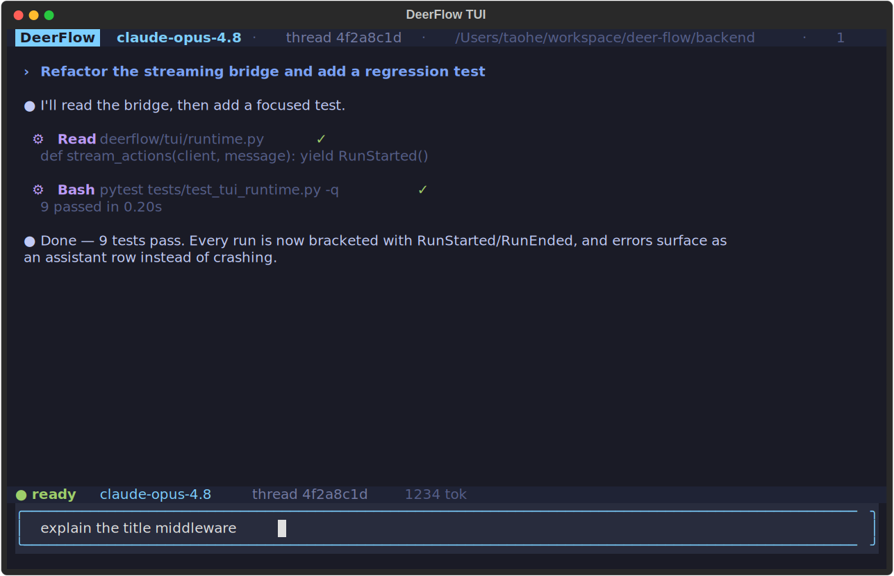

# 🦌 DeerFlow - 2.0

[English](./README.md) | [中文](./README_zh.md) | [日本語](./README_ja.md) | [Français](./README_fr.md) | Русский

[](./backend/pyproject.toml)
[](./Makefile)
[](./LICENSE)

<a href="https://trendshift.io/repositories/14699" target="_blank"></a>

> 28 февраля 2026 года DeerFlow занял 🏆 #1 в GitHub Trending после релиза версии 2. Спасибо огромное нашему сообществу — всё благодаря вам! 💪🔥

DeerFlow (**D**eep **E**xploration and **E**fficient **R**esearch **Flow**) — open-source **Super Agent Harness**, который управляет **Sub-Agents**, **Memory** и **Sandbox** для решения почти любой задачи. Всё на основе расширяемых **Skills**.

https://github.com/user-attachments/assets/a8bcadc4-e040-4cf2-8fda-dd768b999c18

> [!NOTE]
> **DeerFlow 2.0 — проект переписан с нуля.** Общего кода с v1 нет. Если нужен оригинальный Deep Research фреймворк — он живёт в ветке [`1.x`](https://github.com/bytedance/deer-flow/tree/main-1.x), туда тоже принимают контрибьюты. Активная разработка идёт в 2.0.

## Официальный сайт

Больше информации и живые демо на [**официальном сайте**](https://deerflow.tech).

## Coding Plan от ByteDance Volcengine

- Рекомендуем Doubao-Seed-2.0-Code, DeepSeek v3.2 и Kimi 2.5 для запуска DeerFlow
- [Подробнее](https://www.byteplus.com/en/activity/codingplan?utm_campaign=deer_flow&utm_content=deer_flow&utm_medium=devrel&utm_source=OWO&utm_term=deer_flow)
- [Для разработчиков из материкового Китая](https://www.volcengine.com/activity/codingplan?utm_campaign=deer_flow&utm_content=deer_flow&utm_medium=devrel&utm_source=OWO&utm_term=deer_flow)

## InfoQuest

DeerFlow интегрирован с инструментарием для умного поиска и краулинга от BytePlus — [InfoQuest (есть бесплатный онлайн-доступ)](https://docs.byteplus.com/en/docs/InfoQuest/What_is_Info_Quest)

<a href="https://docs.byteplus.com/en/docs/InfoQuest/What_is_Info_Quest" target="_blank">
  
</a>

---

## Содержание

- [🦌 DeerFlow - 2.0](#-deerflow---20)
  - [Официальный сайт](#официальный-сайт)
  - [Coding Plan от ByteDance Volcengine](#coding-plan-от-bytedance-volcengine)
  - [InfoQuest](#infoquest)
  - [Содержание](#содержание)
  - [Установка одной фразой для coding agent](#установка-одной-фразой-для-coding-agent)
  - [Быстрый старт](#быстрый-старт)
    - [Конфигурация](#конфигурация)
    - [Запуск](#запуск)
      - [Вариант 1: Docker (рекомендуется)](#вариант-1-docker-рекомендуется)
      - [Вариант 2: Локальная разработка](#вариант-2-локальная-разработка)
    - [Дополнительно](#дополнительно)
      - [Режим Sandbox](#режим-sandbox)
      - [MCP-сервер](#mcp-сервер)
      - [Мессенджеры](#мессенджеры)
      - [Трассировка LangSmith](#трассировка-langsmith)
  - [От Deep Research к Super Agent Harness](#от-deep-research-к-super-agent-harness)
  - [Core Features](#core-features)
    - [Skills & Tools](#skills--tools)
      - [Интеграция с Claude Code](#интеграция-с-claude-code)
    - [Цели сессии (Session Goals)](#цели-сессии-session-goals)
    - [Sub-Agents](#sub-agents)
    - [Sandbox & файловая система](#sandbox--файловая-система)
    - [Context Engineering](#context-engineering)
    - [Long-Term Memory](#long-term-memory)
  - [Рекомендуемые модели](#рекомендуемые-модели)
  - [Встроенный Python-клиент](#встроенный-python-клиент)
  - [Запланированные задачи (Scheduled Tasks)](#запланированные-задачи-scheduled-tasks)
  - [Терминальная панель (TUI)](#терминальная-панель-tui)
  - [Документация](#документация)
  - [⚠️ Безопасность](#️-безопасность)
  - [Участие в разработке](#участие-в-разработке)
  - [Лицензия](#лицензия)
  - [Благодарности](#благодарности)
    - [Ключевые контрибьюторы](#ключевые-контрибьюторы)
  - [История звёзд](#история-звёзд)

## Установка одной фразой для coding agent

Если вы используете Claude Code, Codex, Cursor, Windsurf или другой coding agent, просто отправьте ему эту фразу:

```text
Если DeerFlow еще не клонирован, сначала клонируй его, а затем подготовь локальное окружение разработки по инструкции https://raw.githubusercontent.com/bytedance/deer-flow/main/Install.md
```

Этот prompt предназначен для coding agent. Он просит агента при необходимости сначала клонировать репозиторий, предпочесть Docker, если он доступен, и в конце вернуть точную команду запуска и список недостающих настроек.

## Быстрый старт

### Конфигурация

1. **Склонировать репозиторий DeerFlow**

   ```bash
   git clone https://github.com/bytedance/deer-flow.git
   cd deer-flow
   ```

2. **Запустить мастер настройки (рекомендуется)**

   Из корня проекта (`deer-flow/`) запустите:

   ```bash
   make setup
   ```

   Запустится интерактивный мастер, который поможет выбрать LLM-провайдера, опциональный веб-поиск и настройки выполнения/безопасности (режим sandbox, доступ к bash, инструменты записи файлов). Он сгенерирует минимальный `config.yaml` и запишет ключи в `.env`. Это занимает около 2 минут.

   В любой момент запускайте `make doctor`, чтобы проверить конфигурацию и получить конкретные подсказки по исправлению.
   Если вы открываете GitHub issue о проблеме с локальной установкой или работой системы, выполните
   `make support-bundle`. Команда выводит дальнейшие шаги для автора отчёта, создаёт файл
   `*-issue-summary.md`, который нужно вставить в issue, файл `*-issue-draft.md`
   для оформления issue с помощью AI и, опционально, zip-архив с диагностикой в
   `.deer-flow/support-bundles/`. Если issue оформляет AI-ассистент, он должен начать
   с черновика и заменить каждый плейсхолдер REQUIRED, а не выдумывать недостающие
   факты. Прикладывайте zip-архив только если его запросит мейнтейнер или если одной
   сводки недостаточно. Мейнтейнеры и AI-инструменты триажа могут начинать с
   `triage.json`; архив содержит только очищенную от чувствительных данных диагностику
   и манифесты файлов и не включает `.env`, исходные сообщения диалогов или содержимое
   пользовательских файлов.

   > **Продвинутая / ручная настройка**: если вы предпочитаете редактировать `config.yaml` напрямую, выполните вместо этого `make config`, чтобы скопировать полный шаблон. Полный справочник — `config.example.yaml`, включая CLI-провайдеров (Codex CLI, Claude Code OAuth), OpenRouter, Responses API и многое другое.

   <details>
   <summary>Примеры ручной настройки моделей</summary>

   ```yaml
   models:
     - name: gpt-4o
       display_name: GPT-4o
       use: langchain_openai:ChatOpenAI
       model: gpt-4o
       api_key: $OPENAI_API_KEY

     - name: openrouter-gemini-2.5-flash
       display_name: Gemini 2.5 Flash (OpenRouter)
       use: langchain_openai:ChatOpenAI
       model: google/gemini-2.5-flash-preview
       api_key: $OPENROUTER_API_KEY
       base_url: https://openrouter.ai/api/v1

     - name: gpt-5-responses
       display_name: GPT-5 (Responses API)
       use: langchain_openai:ChatOpenAI
       model: gpt-5
       api_key: $OPENAI_API_KEY
       use_responses_api: true
       output_version: responses/v1

     - name: qwen3-32b-vllm
       display_name: Qwen3 32B (vLLM)
       use: deerflow.models.vllm_provider:VllmChatModel
       model: Qwen/Qwen3-32B
       api_key: $VLLM_API_KEY
       base_url: http://localhost:8000/v1
       supports_thinking: true
       when_thinking_enabled:
         extra_body:
           chat_template_kwargs:
             enable_thinking: true
   ```

   OpenRouter и аналогичные OpenAI-совместимые шлюзы настраиваются через `langchain_openai:ChatOpenAI` с параметром `base_url`. Если вы предпочитаете имя переменной окружения, специфичное для провайдера, укажите его в `api_key` явно (например, `api_key: $OPENROUTER_API_KEY`).

   Чтобы направить модели OpenAI через `/v1/responses`, продолжайте использовать `langchain_openai:ChatOpenAI` и задайте `use_responses_api: true` вместе с `output_version: responses/v1`.

   Для vLLM 0.19.0 используйте `deerflow.models.vllm_provider:VllmChatModel`. Для reasoning-моделей в стиле Qwen DeerFlow переключает режим рассуждений через `extra_body.chat_template_kwargs.enable_thinking` и сохраняет нестандартное поле `reasoning` vLLM в многоходовых диалогах с вызовами инструментов. Устаревшие конфигурации `thinking` автоматически нормализуются для обратной совместимости. Reasoning-моделям также может потребоваться запуск сервера с флагом `--reasoning-parser ...`. Если ваш локальный vLLM принимает любой непустой API-ключ, всё равно задайте `VLLM_API_KEY` со значением-заглушкой.

   Примеры CLI-провайдеров:

   ```yaml
   models:
     - name: gpt-5.4
       display_name: GPT-5.4 (Codex CLI)
       use: deerflow.models.openai_codex_provider:CodexChatModel
       model: gpt-5.4
       supports_thinking: true
       supports_reasoning_effort: true

     - name: claude-sonnet-4.6
       display_name: Claude Sonnet 4.6 (Claude Code OAuth)
       use: deerflow.models.claude_provider:ClaudeChatModel
       model: claude-sonnet-4-6
       max_tokens: 4096
       supports_thinking: true
   ```

   - Codex CLI читает `~/.codex/auth.json`
   - Claude Code принимает `CLAUDE_CODE_OAUTH_TOKEN`, `ANTHROPIC_AUTH_TOKEN`, `CLAUDE_CODE_CREDENTIALS_PATH` или `~/.claude/.credentials.json`
   - Записи ACP-агентов настраиваются отдельно от провайдеров моделей — если вы настраиваете `acp_agents.codex`, укажите в нём Codex ACP-адаптер, например `npx -y @zed-industries/codex-acp`
   - На macOS при необходимости экспортируйте аутентификацию Claude Code явно:

   ```bash
   eval "$(python3 scripts/export_claude_code_oauth.py --print-export)"
   ```

   API-ключи также можно задать вручную в `.env` (рекомендуется) или экспортировать в оболочке:

   ```bash
   OPENAI_API_KEY=your-openai-api-key
   TAVILY_API_KEY=your-tavily-api-key
   ```

   </details>

### Запуск

#### Вариант 1: Docker (рекомендуется)

**Разработка** (hot-reload, монтирование исходников):

```bash
make docker-init    # Загрузить образ Sandbox (один раз или при обновлении)
make docker-start   # Запустить сервисы
```

**Продакшен** (собирает образы локально):

```bash
make up     # Собрать образы и запустить все сервисы
make down   # Остановить и удалить контейнеры
```

> [!TIP]
> На Linux при ошибке `permission denied` для Docker daemon добавьте пользователя в группу `docker` и перелогиньтесь. Подробнее в [CONTRIBUTING.md](CONTRIBUTING.md#linux-docker-daemon-permission-denied).

Адрес: http://localhost:2026

#### Вариант 2: Локальная разработка

Предварительное условие: сначала выполните шаги раздела «Конфигурация» выше (`make setup`). Для `make dev` нужен корректный `config.yaml` в корне проекта. Задайте `DEER_FLOW_PROJECT_ROOT`, чтобы явно указать корень проекта, или `DEER_FLOW_CONFIG_PATH`, чтобы указать конкретный файл конфигурации. Состояние времени выполнения по умолчанию записывается в `.deer-flow` в корне проекта и может быть перенесено через `DEER_FLOW_HOME`; skills по умолчанию читаются из `skills/` в корне проекта, путь можно переопределить через `DEER_FLOW_SKILLS_PATH`. Перед запуском выполните `make doctor`, чтобы проверить настройку.
В Windows запускайте локальный процесс разработки из Git Bash. Нативные оболочки `cmd.exe` и PowerShell не поддерживаются для сервисных скриптов на bash, а работа в WSL не гарантируется, поскольку некоторые скрипты зависят от утилит Git for Windows, таких как `cygpath`.

1. **Проверить зависимости**:
   ```bash
   make check  # Проверяет Node.js 22+, pnpm, uv, nginx
   ```

2. **Установить зависимости**:
   ```bash
   make install
   ```

3. **(Опционально) Загрузить образ Sandbox заранее**:
   ```bash
   make setup-sandbox
   ```

4. **Запустить сервисы**:
   ```bash
   make dev
   ```

5. **Адрес**: http://localhost:2026

### Дополнительно

#### Режим Sandbox

DeerFlow поддерживает несколько режимов выполнения:
- **Локальное выполнение** — код запускается прямо на хосте
- **Docker** — код выполняется в изолированных Docker-контейнерах
- **Docker + Kubernetes** — выполнение в Kubernetes-подах через provisioner

Подробнее в [руководстве по конфигурации Sandbox](backend/docs/CONFIGURATION.md#sandbox).

#### MCP-сервер

DeerFlow поддерживает настраиваемые MCP-серверы для расширения возможностей. Для HTTP/SSE MCP-серверов поддерживаются OAuth-токены (`client_credentials`, `refresh_token`). Подробнее в [руководстве по MCP-серверу](backend/docs/MCP_SERVER.md).

#### Мессенджеры

DeerFlow принимает задачи прямо из мессенджеров. Каналы запускаются автоматически при настройке, публичный IP не нужен.

DeerFlow может также предоставлять в workspace UI пользовательские подключения IM-каналов. Когда включён `channel_connections`, вошедшие в систему пользователи могут привязать Telegram, Slack, Discord, Feishu/Lark, DingTalk, WeChat или WeCom из боковой панели / Settings > Channels. Это переиспользует существующие исходящие транспорты `channels.*`, поэтому публичный IP или URL обратного вызова провайдера не требуются. Входящие IM-сообщения выполняются от имени подключённого пользователя DeerFlow. Настройки и вопросы безопасности описаны в [IM Channel Connections](backend/docs/IM_CHANNEL_CONNECTIONS.md).

| Канал | Транспорт | Сложность |
|-------|-----------|-----------|
| Telegram | Bot API (long-polling) | Просто |
| Slack | Socket Mode | Средне |
| Feishu / Lark | WebSocket | Средне |
| WeChat | Tencent iLink (long-polling) | Средне |
| WeCom | WebSocket | Средне |
| DingTalk | Stream Push (WebSocket) | Средне |

**Конфигурация в `config.yaml`:**

```yaml
channels:
  feishu:
    enabled: true
    app_id: $FEISHU_APP_ID
    app_secret: $FEISHU_APP_SECRET
    # domain: https://open.feishu.cn       # China (default)
    # domain: https://open.larksuite.com   # International

  wecom:
    enabled: true
    bot_id: $WECOM_BOT_ID
    bot_secret: $WECOM_BOT_SECRET

  slack:
    enabled: true
    bot_token: $SLACK_BOT_TOKEN
    app_token: $SLACK_APP_TOKEN
    allowed_users: []

  telegram:
    enabled: true
    bot_token: $TELEGRAM_BOT_TOKEN
    allowed_users: []

  wechat:
    enabled: false
    bot_token: $WECHAT_BOT_TOKEN
    ilink_bot_id: $WECHAT_ILINK_BOT_ID
    qrcode_login_enabled: true      # опционально: разрешить первичную загрузку через QR-код при отсутствии bot_token
    allowed_users: []               # пусто = разрешить всем
    polling_timeout: 35
    state_dir: ./.deer-flow/wechat/state
    max_inbound_image_bytes: 20971520
    max_outbound_image_bytes: 20971520
    max_inbound_file_bytes: 52428800
    max_outbound_file_bytes: 52428800

  dingtalk:
    enabled: true
    client_id: $DINGTALK_CLIENT_ID             # ClientId с DingTalk Open Platform
    client_secret: $DINGTALK_CLIENT_SECRET     # ClientSecret с DingTalk Open Platform
    allowed_users: []                          # пусто = разрешить всем
    card_template_id: ""                       # Опционально: ID шаблона AI Card для потокового эффекта печатной машинки
```

**Ключи API в `.env`:**

```bash
# Telegram
TELEGRAM_BOT_TOKEN=123456789:ABCdefGHIjklMNOpqrSTUvwxYZ

# Slack
SLACK_BOT_TOKEN=xoxb-...
SLACK_APP_TOKEN=xapp-...

# Feishu / Lark
FEISHU_APP_ID=cli_xxxx
FEISHU_APP_SECRET=your_app_secret

# WeChat iLink
WECHAT_BOT_TOKEN=your_ilink_bot_token
WECHAT_ILINK_BOT_ID=your_ilink_bot_id

# WeCom
WECOM_BOT_ID=your_bot_id
WECOM_BOT_SECRET=your_bot_secret

# DingTalk
DINGTALK_CLIENT_ID=your_client_id
DINGTALK_CLIENT_SECRET=your_client_secret
```

**Настройка Telegram**

1. Напишите [@BotFather](https://t.me/BotFather), отправьте `/newbot` и скопируйте HTTP API-токен.
2. Укажите `TELEGRAM_BOT_TOKEN` в `.env` и включите канал в `config.yaml`.

**Настройка WeChat**

1. Включите канал `wechat` в `config.yaml`.
2. Либо задайте `WECHAT_BOT_TOKEN` в `.env`, либо установите `qrcode_login_enabled: true` для первичной загрузки через QR-код.
3. Когда `bot_token` отсутствует и загрузка через QR включена, следите за логами бэкенда — там появится QR-контент, возвращённый iLink, — и завершите процесс привязки.
4. После успешного прохождения QR-процесса DeerFlow сохраняет полученный токен в `state_dir` для последующих перезапусков.
5. Для развёртываний Docker Compose держите `state_dir` на постоянном томе, чтобы курсор `get_updates_buf` и сохранённое состояние аутентификации переживали перезапуски.

**Настройка WeCom**

1. Создайте бота на платформе WeCom AI Bot и получите `bot_id` и `bot_secret`.
2. Включите `channels.wecom` в `config.yaml` и заполните `bot_id` / `bot_secret`.
3. Задайте `WECOM_BOT_ID` и `WECOM_BOT_SECRET` в `.env`.
4. Убедитесь, что зависимости бэкенда включают `wecom-aibot-python-sdk`. Канал использует долговременное WebSocket-соединение и не требует публичного URL обратного вызова.
5. Текущая интеграция поддерживает входящие текстовые сообщения, изображения и файлы. Итоговые изображения/файлы, сгенерированные агентом, также отправляются обратно в диалог WeCom.

**Настройка DingTalk**

1. Создайте приложение на [DingTalk Open Platform](https://open.dingtalk.com/) и включите возможность **Робот**.
2. На странице настроек робота установите режим приёма сообщений на **Stream**.
3. Скопируйте `Client ID` и `Client Secret`. Укажите `DINGTALK_CLIENT_ID` и `DINGTALK_CLIENT_SECRET` в `.env` и включите канал в `config.yaml`.
4. *(Опционально)* Для включения потоковых ответов AI Card (эффект печатной машинки) создайте шаблон **AI Card** на [платформе карточек DingTalk](https://open.dingtalk.com/document/dingstart/typewriter-effect-streaming-ai-card), затем укажите `card_template_id` в `config.yaml` с ID шаблона. Также необходимо запросить разрешения `Card.Streaming.Write` и `Card.Instance.Write`.

**Доступные команды**

| Команда | Описание |
|---------|----------|
| `/new` | Начать новый диалог |
| `/status` | Показать информацию о текущем треде |
| `/models` | Список доступных моделей |
| `/memory` | Просмотреть память |
| `/help` | Показать справку |

> Сообщения без команды воспринимаются как обычный чат — DeerFlow создаёт тред и отвечает.

#### Трассировка LangSmith

DeerFlow имеет встроенную интеграцию с [LangSmith](https://smith.langchain.com) для наблюдаемости. При включении все вызовы LLM, запуски агентов и выполнения инструментов отслеживаются и отображаются в дашборде LangSmith.

Добавьте в файл `.env` в корне проекта:

```bash
LANGSMITH_TRACING=true
LANGSMITH_API_KEY=lsv2_pt_xxxxxxxxxxxxxxxx
LANGSMITH_PROJECT=deer-flow
```

`LANGSMITH_ENDPOINT` по умолчанию `https://api.smith.langchain.com` и может быть переопределён при необходимости. Устаревшие переменные `LANGCHAIN_*` (`LANGCHAIN_TRACING_V2`, `LANGCHAIN_API_KEY` и т.д.) также поддерживаются для обратной совместимости; `LANGSMITH_*` имеет приоритет, когда заданы обе.

В Docker-развёртываниях трассировка отключена по умолчанию. Установите `LANGSMITH_TRACING=true` и `LANGSMITH_API_KEY` в `.env` для включения.

## От Deep Research к Super Agent Harness

DeerFlow начинался как фреймворк для Deep Research, и сообщество вышло далеко за эти рамки. После запуска разработчики строили пайплайны, генерировали презентации, поднимали дашборды, автоматизировали контент. То, чего мы не ожидали.

Стало понятно: DeerFlow не просто research-инструмент. Это **harness**: runtime, который даёт агентам необходимую инфраструктуру.

Поэтому мы переписали всё с нуля.

DeerFlow 2.0 — это Super Agent Harness «из коробки». Batteries included, полностью расширяемый. Построен на LangGraph и LangChain. По умолчанию есть всё, что нужно агенту: файловая система, memory, skills, sandbox-выполнение и возможность планировать и запускать sub-agents для сложных многошаговых задач.

Используйте как есть. Или разберите и переделайте под себя.

## Core Features

### Skills & Tools

Skills — это то, что позволяет DeerFlow делать почти что угодно.

Agent Skill — это структурированный модуль: Markdown-файл с описанием воркфлоу, лучших практик и ссылок на ресурсы. DeerFlow поставляется со встроенными skills для ресёрча, генерации отчётов, слайдов, веб-страниц, изображений и видео. Но главное — расширяемость: добавляйте свои skills, заменяйте встроенные или собирайте из них составные воркфлоу.

Skills загружаются по мере необходимости, только когда задача их требует. Это держит контекстное окно чистым.

```
# Пути внутри контейнера sandbox
/mnt/skills/public
├── research/SKILL.md
├── report-generation/SKILL.md
├── slide-creation/SKILL.md
├── web-page/SKILL.md
└── image-generation/SKILL.md

/mnt/skills/custom
└── your-custom-skill/SKILL.md      ← ваш skill
```

#### Интеграция с Claude Code

Skill `claude-to-deerflow` позволяет работать с DeerFlow прямо из [Claude Code](https://docs.anthropic.com/en/docs/claude-code). Отправляйте задачи, проверяйте статус, управляйте тредами, не выходя из терминала.

**Установка скилла**:

```bash
npx skills add https://github.com/bytedance/deer-flow --skill claude-to-deerflow
```

**Что можно делать**:
- Отправлять сообщения в DeerFlow и получать потоковые ответы
- Выбирать режимы выполнения: flash (быстро), standard, pro (planning), ultra (sub-agents)
- Проверять статус DeerFlow, просматривать модели, скиллы, агентов
- Управлять тредами и историей диалога
- Загружать файлы для анализа

Полный справочник API в [`skills/public/claude-to-deerflow/SKILL.md`](skills/public/claude-to-deerflow/SKILL.md).

### Цели сессии (Session Goals)

Используйте `/goal <условие завершения>`, чтобы привязать к текущему треду одно активное условие завершения. Цель — это состояние уровня треда, а не активация навыка, поэтому она остаётся активной между ходами, пока DeerFlow не сочтёт её выполненной или пока вы её не очистите.

Поддерживаемые команды:

```text
/goal finish the implementation and make all tests pass
/goal              # показать активную цель
/goal clear        # очистить её
```

После каждого запуска, выполненного через Gateway, DeerFlow оценивает видимый диалог относительно активной цели с помощью non-thinking модели-оценщика. Оценщик должен вернуть типизированный блокер (`missing_evidence`, `needs_user_input`, `run_failed`, `external_wait` или `goal_not_met_yet`) с видимыми доказательствами. DeerFlow добавляет hidden continuation только тогда, когда последний ход assistant сохранён в чекпоинте, блокер имеет тип `goal_not_met_yet`, тред не изменился во время оценки и счётчик отсутствия прогресса не сработал. Предел безопасности по умолчанию — 8 hidden continuation, а повторяющиеся одинаковые оценки без прогресса останавливаются после 2 попыток. `/goal clear` и любой новый ввод от пользователя имеют приоритет над continuation в очереди. Когда цель выполнена, DeerFlow очищает её автоматически и публикует обновлённое состояние треда.

Веб-интерфейс показывает активную цель над полем ввода. Та же команда доступна из TUI и поддерживаемых IM-каналов. В веб-интерфейсе и поддерживаемых IM-каналах установка `/goal <условие завершения>` также запускает выполнение с условием в качестве задачи; команды статуса и очистки только управляют состоянием цели.

### Sub-Agents

Сложные задачи редко решаются за один проход. DeerFlow их декомпозирует.

Lead agent запускает sub-agents на лету, каждый со своим изолированным контекстом, инструментами и условиями завершения. Sub-agents работают параллельно, возвращают структурированные результаты, а lead agent собирает всё в единый итог.

Вот как DeerFlow справляется с задачами на минуты и часы: research-задача разветвляется в дюжину sub-agents, каждый копает свой угол, потом всё сходится в один отчёт, или сайт, или слайддек со сгенерированными визуалами. Один harness, много рук.

### Sandbox & файловая система

DeerFlow не просто *говорит* о том, что умеет что-то делать. У него есть собственный компьютер.

Каждая задача выполняется внутри изолированного Docker-контейнера с полной файловой системой: skills, workspace, uploads, outputs. Агент читает, пишет и редактирует файлы. Выполняет bash-команды и пишет код. Смотрит на изображения. Всё изолировано, всё прозрачно, никакого пересечения между сессиями.

Это разница между чатботом с доступом к инструментам и агентом с реальной средой выполнения.

```
# Пути внутри контейнера sandbox
/mnt/user-data/
├── uploads/          ← ваши файлы
├── workspace/        ← рабочая директория агентов
└── outputs/          ← результаты
```

### Context Engineering

**Изолированный контекст**: каждый sub-agent работает в своём контексте и не видит контекст главного агента или других sub-agents. Агент фокусируется на своей задаче.

**Управление контекстом**: внутри сессии DeerFlow агрессивно сжимает контекст и суммирует завершённые подзадачи, выгружает промежуточные результаты в файловую систему, сжимает то, что уже не актуально. На длинных многошаговых задачах контекстное окно не переполняется.

### Long-Term Memory

Большинство агентов забывают всё, когда диалог заканчивается. DeerFlow помнит.

DeerFlow сохраняет ваш профиль, предпочтения и накопленные знания между сессиями. Чем больше используете, тем лучше он вас знает: стиль, технологический стек, повторяющиеся воркфлоу. Всё хранится локально и остаётся под вашим контролем.

## Рекомендуемые модели

DeerFlow работает с любым LLM через OpenAI-совместимый API. Лучше всего — с моделями, которые поддерживают:

- **Большое контекстное окно** (100k+ токенов) — для deep research и многошаговых задач
- **Reasoning capabilities** — для адаптивного планирования и сложной декомпозиции
- **Multimodal inputs** — для работы с изображениями и видео
- **Strong tool-use** — для надёжного вызова функций и структурированных ответов

## Встроенный Python-клиент

DeerFlow можно использовать как Python-библиотеку прямо в коде — без запуска HTTP-сервисов. `DeerFlowClient` даёт доступ ко всем возможностям агента и Gateway, возвращает те же схемы ответов, что и HTTP Gateway API. HTTP Gateway также предоставляет `DELETE /api/threads/{thread_id}` для удаления локальных данных треда, управляемых DeerFlow, после того как сам LangGraph thread был удалён:

```python
from deerflow.client import DeerFlowClient

client = DeerFlowClient()

# Chat
response = client.chat("Analyze this paper for me", thread_id="my-thread")

# Streaming (LangGraph SSE protocol: values, messages-tuple, end)
for event in client.stream("hello"):
    if event.type == "messages-tuple" and event.data.get("type") == "ai":
        print(event.data["content"])

# Configuration & management — returns Gateway-aligned dicts
models = client.list_models()        # {"models": [...]}
skills = client.list_skills()        # {"skills": [...]}
client.update_skill("web-search", enabled=True)
client.upload_files("thread-1", ["./report.pdf"])  # {"success": True, "files": [...]}
client.set_goal("thread-1", "finish the implementation and make all tests pass")
client.get_goal("thread-1")       # {"goal": {...}} or {"goal": None}
client.clear_goal("thread-1")
```

## Запланированные задачи (Scheduled Tasks)

Теперь в DeerFlow есть первоклассный MVP запланированных задач (scheduled-task) в workspace.

Текущие возможности MVP:

- Управление задачами на `/workspace/scheduled-tasks`
- Выбор: каждая запланированная задача переиспользует тред или создаёт новый тред для каждого запуска
- Поддержка расписаний `once` и `cron`
- Фоновые запланированные запуски выполняются как неинтерактивные запуски DeerFlow (`ask_clarification` там не предоставляется)
- При совпадении наступившего cron-запуска с активным запуском на том же переиспользуемом треде применяется поведение перекрытия `skip`
- Приостановка, возобновление, ручной запуск, просмотр истории и удаление задач
- Запланированные задачи выполняются через стандартный жизненный цикл запуска DeerFlow

Текущие ограничения MVP:

- Пока нет инструмента `schedule_task`, создающего задачи в диалоге
- Нет заданий с текстовыми уведомлениями
- Нет каналов или целей отправки GitHub
- В этой первой версии нет типа расписания `interval`

Включите фоновый опрос через `config.yaml -> scheduler.enabled`. Ручной запуск использует тот же ресурс и путь выполнения scheduled-task.

## Терминальная панель (TUI)

`deerflow` — это нативная терминальная панель для тех, кто живёт в шелле. Она работает **встроенной** поверх `DeerFlowClient` — без Gateway, фронтенда, nginx или Docker — и при этом учитывает те же настройки `config.yaml`, checkpointer, skills, memory, MCP и sandbox, что и остальной DeerFlow.



```bash
uv pip install 'deerflow-harness[tui]'        # опциональная зависимость 'textual'

deerflow                                      # запустить терминальный UI (требуется TTY)
deerflow --continue                           # возобновить последний тред
deerflow --resume THREAD                      # возобновить тред по id
deerflow --print "summarize this repo"        # автономный разовый ответ в stdout
deerflow --json  "hello"                       # автономный режим, StreamEvents с разделением новой строкой
```

Интерфейс чата с управлением с клавиатуры: потоковый транскрипт (ответы рендерятся в Markdown), компактные карточки активности инструментов, палитра слэш-команд `/`, управление целями `/goal`, селекторы `/model` и `/threads`, история ввода, а также прерывание через `Esc` / `Ctrl+C`. Сессии, открытые в TUI, также появляются в боковой панели веб-интерфейса — TUI пишет в общее хранилище тредов под локальным пользователем по умолчанию, поэтому терминал и веб остаются синхронизированными **без запуска Gateway**.

Полное руководство — в [backend/docs/TUI.md](backend/docs/TUI.md).

## Документация

- [Руководство по участию](CONTRIBUTING.md) — настройка среды разработки, воркфлоу и гайдлайны
- [Руководство по конфигурации](backend/docs/CONFIGURATION.md) — инструкции по настройке
- [Обзор архитектуры](backend/CLAUDE.md) — технические детали
- [Архитектура бэкенда](backend/README.md) — бэкенд и справочник API

## ⚠️ Безопасность

### Неправильное развёртывание может привести к угрозам безопасности

DeerFlow обладает ключевыми высокопривилегированными возможностями, включая **выполнение системных команд, операции с ресурсами и вызов бизнес-логики**. По умолчанию он рассчитан на **развёртывание в локальной доверенной среде (доступ только через loopback-адрес 127.0.0.1)**. Если вы разворачиваете агент в недоверенных средах — локальных сетях, публичных облачных серверах или других окружениях, доступных с нескольких устройств — без строгих мер безопасности, это может привести к следующим угрозам:

- **Несанкционированные вызовы**: функциональность агента может быть обнаружена неавторизованными третьими лицами или вредоносными сканерами, что приведёт к массовым несанкционированным запросам с выполнением высокорисковых операций (системные команды, чтение/запись файлов) и серьёзным последствиям для безопасности.
- **Юридические и compliance-риски**: если агент будет незаконно использован для кибератак, кражи данных или других противоправных действий, это может повлечь юридическую ответственность и compliance-риски.

### Рекомендации по безопасности

**Примечание: настоятельно рекомендуем развёртывать DeerFlow только в локальной доверенной сети.** Если вам необходимо развёртывание через несколько устройств или сетей, обязательно реализуйте строгие меры безопасности, например:

- **Белый список IP-адресов**: используйте `iptables` или аппаратные межсетевые экраны / коммутаторы с ACL, чтобы **настроить правила белого списка IP** и заблокировать доступ со всех остальных адресов.
- **Шлюз аутентификации**: настройте обратный прокси (nginx и др.) и **включите строгую предварительную аутентификацию**, запрещающую любой доступ без авторизации.
- **Сетевая изоляция**: по возможности разместите агент и доверенные устройства в **одном выделенном VLAN**, изолированном от остальной сети.
- **Следите за обновлениями**: регулярно отслеживайте обновления безопасности проекта DeerFlow.

## Участие в разработке

Приветствуем контрибьюторов! Настройка среды разработки, воркфлоу и гайдлайны — в [CONTRIBUTING.md](CONTRIBUTING.md).

## Лицензия

Проект распространяется под [лицензией MIT](./LICENSE).

## Благодарности

DeerFlow стоит на плечах open-source сообщества. Спасибо всем проектам и разработчикам, чья работа сделала его возможным.

Отдельная благодарность:

- **[LangChain](https://github.com/langchain-ai/langchain)** — фреймворк для взаимодействия с LLM и построения цепочек.
- **[LangGraph](https://github.com/langchain-ai/langgraph)** — многоагентная оркестрация, на которой держатся сложные воркфлоу DeerFlow.

### Ключевые контрибьюторы

Авторы DeerFlow, без которых проекта бы не было:

- **[Daniel Walnut](https://github.com/hetaoBackend/)**
- **[Henry Li](https://github.com/magiccube/)**

## История звёзд

[](https://star-history.com/#bytedance/deer-flow&Date)
