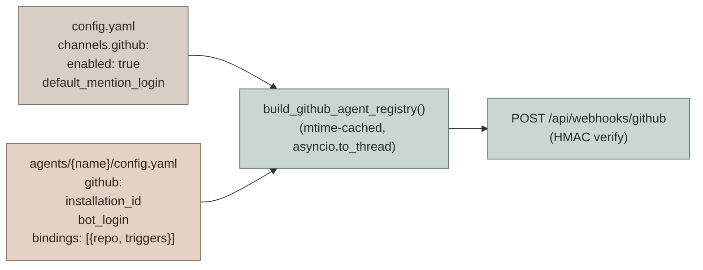
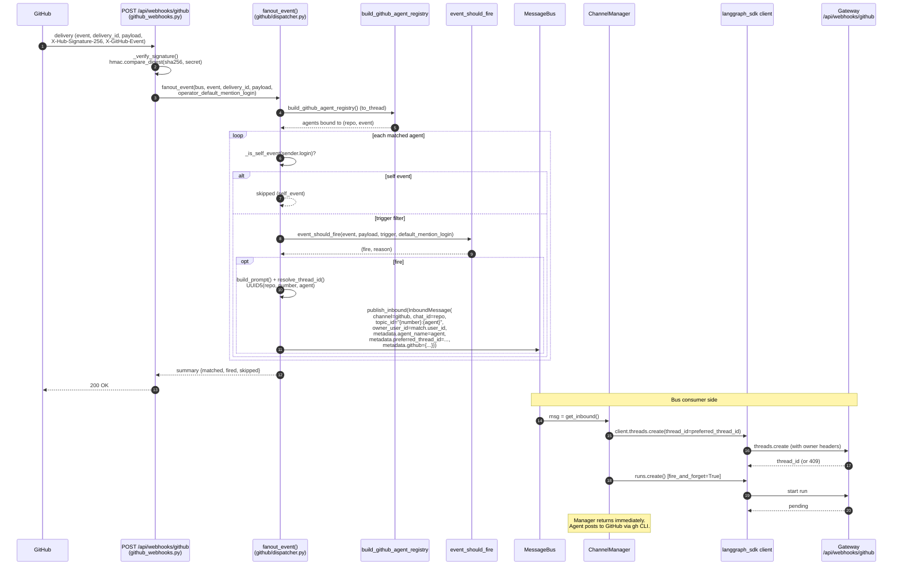
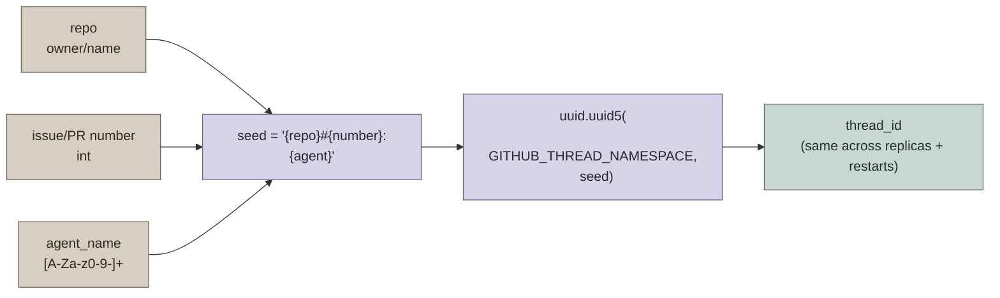
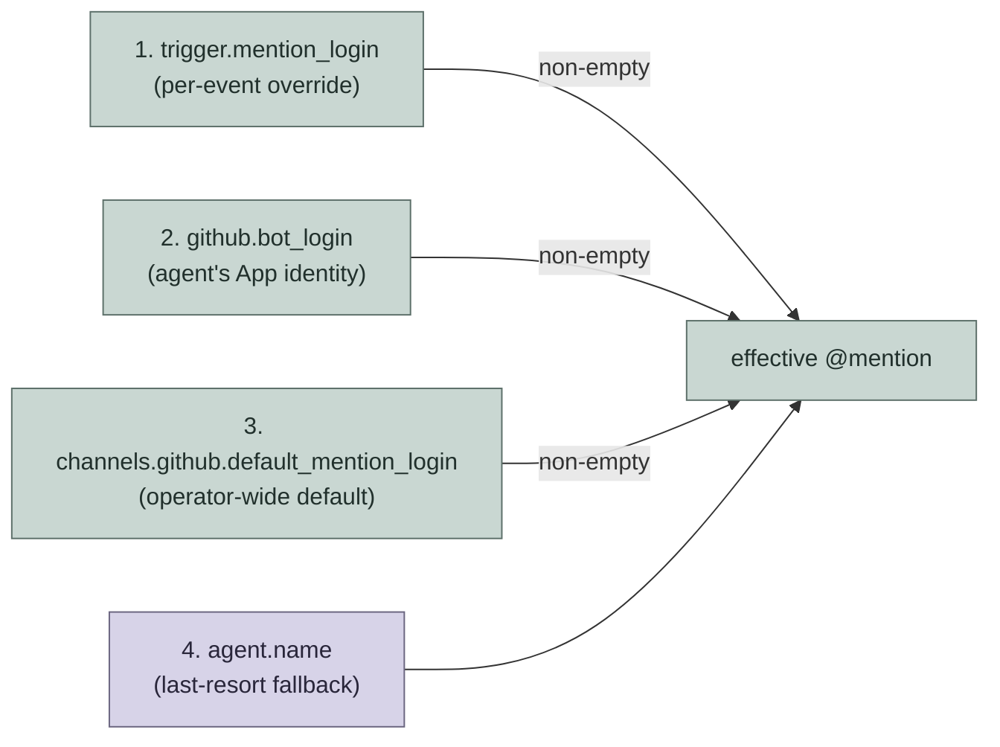
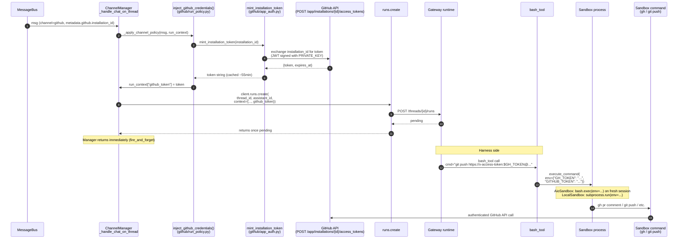
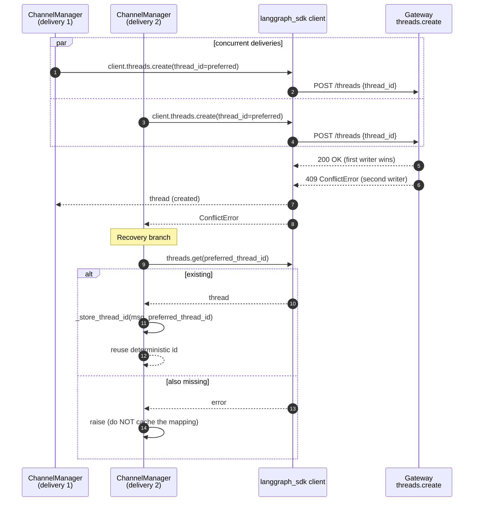
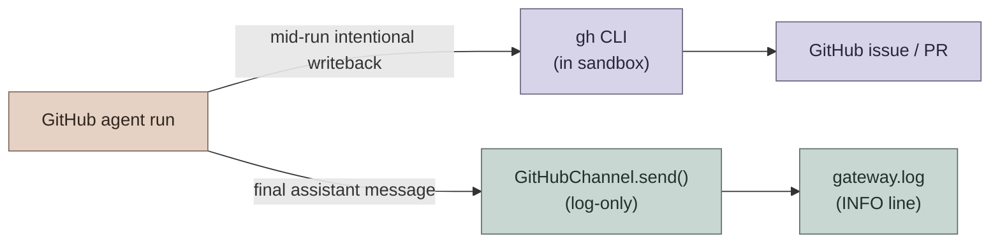

# GitHub Event-Driven Agents

GitHub is a **webhook-push** channel: there is no long-polling worker. Every GitHub App / repository delivery lands at `POST /api/webhooks/github`, where it is HMAC-verified, fan-out'd to one `InboundMessage` per matching custom-agent binding, and shipped to the rest of DeerFlow through the same `ChannelManager` that handles Feishu/Slack/Telegram. For the high-level orientation, see [AGENTS.md](../AGENTS.md) → "GitHub event-driven agents".

This document covers the **architecture** of that pipeline:

- Per-agent bindings (`config.yaml` → `github:` block)
- Webhook → fan-out → `InboundMessage` dispatch
- Mention-handle precedence for `require_mention` triggers
- `preferred_thread_id = UUID5(repo, number, agent_name)` thread determinism
- GH token lifecycle (`GITHUB_APP_ID` + `PRIVATE_KEY` → `run_context["github_token"]` → sandbox `GH_TOKEN`/`GITHUB_TOKEN`)
- `ConflictError` (HTTP 409) thread-create race recovery
- Why **outbound is log-only** (agents post via `gh` from their sandbox)

## Overview

GitHub bindings are declared **per custom agent** in `users/{owner_user_id}/agents/{agent_name}/config.yaml` under a `github:` block. The global `config.yaml` `channels.github` block is intentionally minimal — only the operator kill-switch (`enabled`) and `default_mention_login` live there. Everything that identifies "which agent handles which repo" lives next to the agent that owns it.

Each agent binding lists the **events it cares about** under `triggers:`. Events absent from `triggers:` are not delivered to that agent — the dispatcher never loads the agent for them. `DEFAULT_TRIGGERS` only supplies **field-level defaults** (e.g. `require_mention: true`) for events a binding did declare; it is no longer an enablement list.

## Webhook → Fan-out → Dispatch

The webhook handler stays cheap — no LangGraph calls — so GitHub's 10-second delivery timeout is never at risk. Verification, fan-out, and the bus publish are all in-process and bounded.

## `preferred_thread_id = UUID5(...)` Thread Determinism

`resolve_thread_id(repo, issue_or_pr_number, agent_name)` builds a deterministic LangGraph thread id so a `(repo, PR/issue number)` always lands on the same thread — even after a store wipe, even across gateway replicas (same UUID5 namespace).

Different agents on the same PR (coder + reviewer) **deliberately** get different thread ids — `agent_name` is part of the seed. Sharing a thread would couple their message histories and checkpoints, and `multitask_strategy="reject"` would silently drop one run on every dual-mention. Each agent owns its own thread; cross-agent coordination flows through GitHub (PR comments, review threads), the source of truth humans see.

`ChannelStore` uses `topic_id = f"{number}:{agent_name}"` as its cache key, so each agent's cached mapping is independent — a coder's mapping is invisible to a reviewer on the same PR.

## Mention-handle Precedence

For bindings that declare `require_mention: true` on a given event, the dispatcher must resolve **which** mention login gates the trigger. The precedence chain is:

Whitespace-only values at every level are treated as unset, so the chain falls through cleanly. The `_is_self_event` gate uses the same precedence (with the agent's whole `bindings[*].triggers[*].mention_login` aggregated across all bindings, plus an `agent.name` fallback) so the self-loop gate and the mention gate stay coherent.

## GH Token Lifecycle

GitHub Agents get push/write credentials as **per-call installation tokens**, not as inherited environment. The minted token string is bound into `run_context["github_token"]` on the bus-consumer side and exposed to the agent's sandbox commands as both `GH_TOKEN` and `GITHUB_TOKEN` via per-call `extra_env` on `execute_command`. No `os.environ` mutation, no cross-repo bleed.

Why a string and not a closure: `run_context` is JSON-encoded by the `langgraph_sdk` HTTP client before reaching Gateway. A Python callable does not survive that serialization. The harness side (`_github_env_from_runtime`) already accepts either shape, but only `str` round-trips through the SDK transport.

**Token TTL caveat**: GitHub installation tokens are valid for ~1 hour. Most agent runs finish well inside that window. Truly long coder runs (multi-hour refactors at the higher `recursion_limit=250` ceiling) may see a 401 on a late `git push` / `gh pr create`. Auto-refresh past the 1h TTL is intentionally deferred — it requires registering a token-provider lookup on the harness side, which crosses the harness/app boundary (`tests/test_harness_boundary.py`). Until refresh ships, long runs should finish GitHub writes before expiry or accept the loss. If minting fails (bad App id, wrong installation_id, missing private key), the agent still runs without push/write credentials — read-only is better than no response.

## Thread-create Race Recovery

Two webhook deliveries for the same `(repo, number)` can land within milliseconds of each other and race on `threads.create(thread_id=preferred_thread_id)`. The recovery is narrow by design.

The recovery is **narrow**: only `langgraph_sdk.errors.ConflictError` (HTTP 409) is treated as a concurrent-create collision. Any other failure (transient DB outage, network error, 5xx) propagates so the delivery can fail/retry rather than silently caching `preferred_thread_id` into the store and mapping every future webhook on this issue/PR to a thread that was never created (every later run would 404 forever with no retry path).

The follow-up `threads.get(preferred_thread_id)` is itself verified before caching — if it also rejects, the store underneath is in an inconsistent state and the failure surfaces.

## Outbound is Log-only

GitHub agents post to GitHub themselves via the `gh` CLI from inside their sandbox (`gh issue comment`, `gh pr comment`, `gh pr create`, etc.). The channel's `send()` is **log-only** by design — the agent's final assistant message is logged at INFO for visibility but never auto-posted.

Why:

- **Multiple agents can bind the same event.** coder + reviewer on a mention would each auto-post a reply, producing two replies per mention even when only one had useful work. Letting the LLM call `gh` mid-run means silence is just "the LLM did not call `gh`".
- **The agent often wants to post intermediate updates** (an issue comment linking the PR, a sub-issue comment, a PR description edit). The auto-post-the-final-message contract didn't model that and forced the final message to play double duty.
- **The dispatcher's per-agent `_is_self_event` gate** already prevents comments the LLM posts via `gh` from looping the webhook back into a new run for the same agent.

This is also why the GitHub channel registers `ChannelRunPolicy.fire_and_forget=True`: the manager calls `runs.create()` and returns once the run is `pending`, no outbound ferrying, no SDK 300s `httpx.ReadTimeout` on a legitimate long coder run.

## Cross-references

- [AGENTS.md](../AGENTS.md) → "GitHub event-driven agents" — the index view in `backend/AGENTS.md` (binding shape, per-event triggers, mention precedence, token env summary)
- [IM_CHANNEL_CONNECTIONS.md](IM_CHANNEL_CONNECTIONS.md) — interactive IM channels (Telegram/Slack/etc.) for the full `_handle_chat` and owner-scoped file storage flow
- `app/gateway/github/dispatcher.py` — `fanout_event`, `_is_self_event`, mention precedence chain
- `app/gateway/github/identity.py` — `resolve_thread_id` (UUID5), `extract_target`
- `app/gateway/github/triggers.py` — `event_should_fire`, `DEFAULT_TRIGGERS`
- `app/gateway/github/run_policy.py` — `inject_github_credentials`, `register_policy`
- `app/gateway/routers/github_webhooks.py` — HMAC verify, route mount predicate
- `app/channels/github.py` — `GitHubChannel` (log-only outbound)