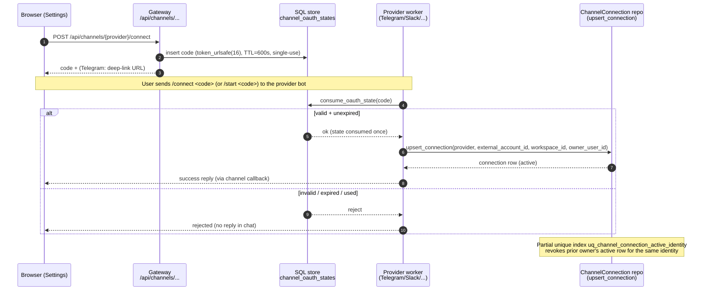
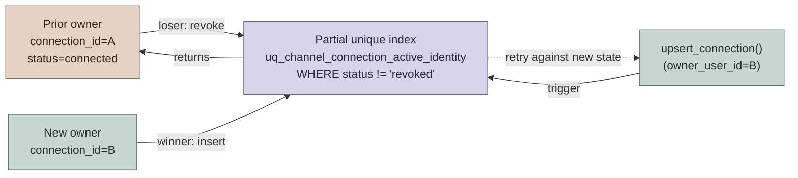
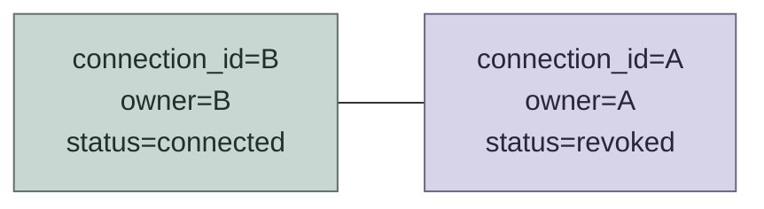
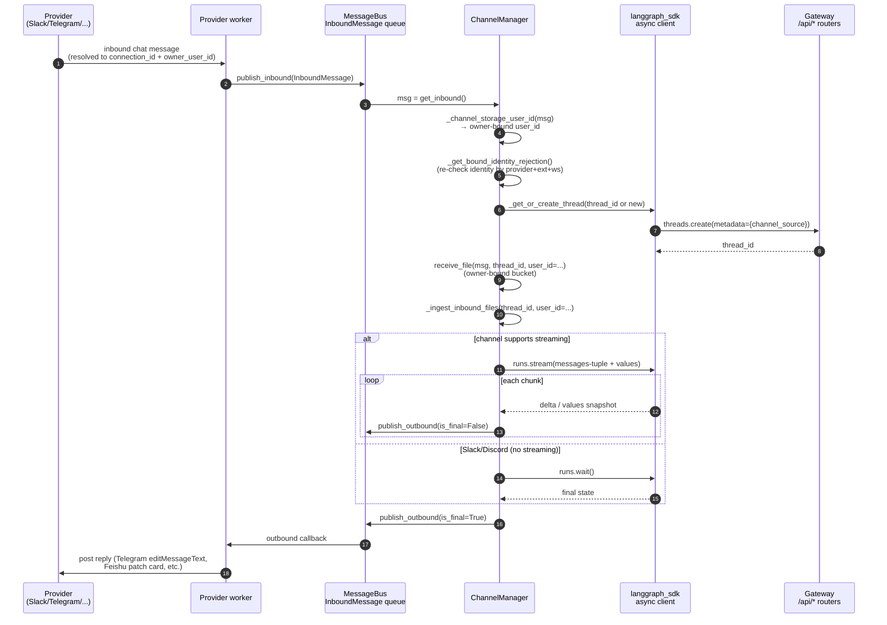
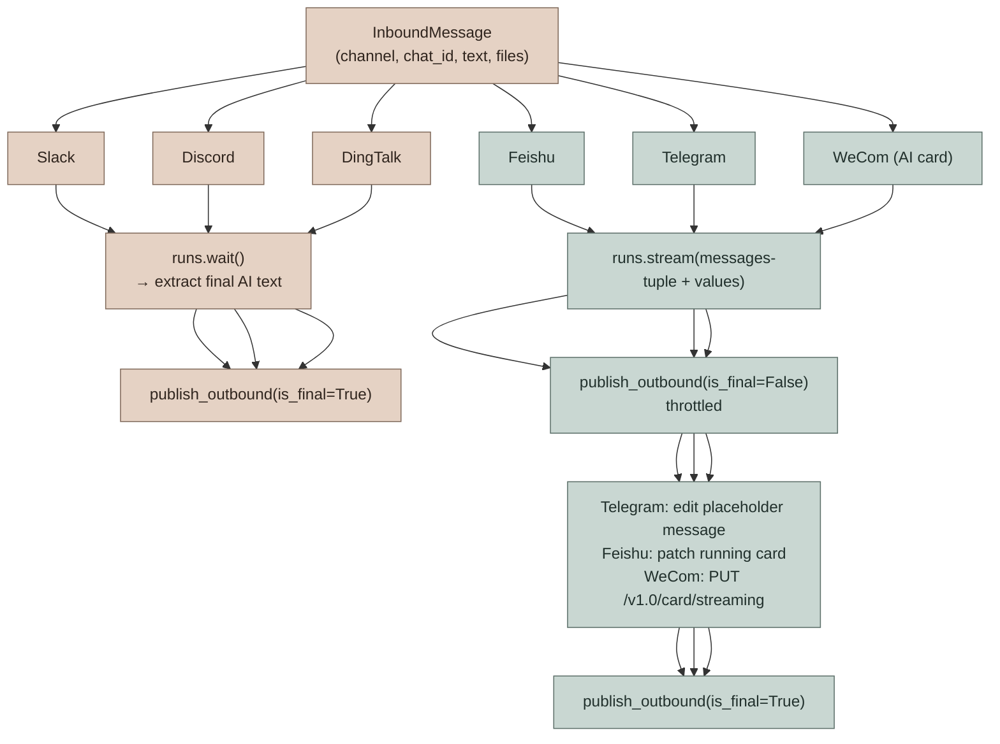
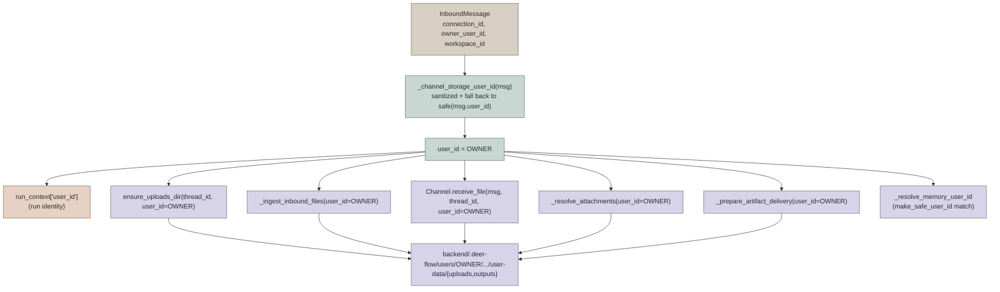

# IM Channel Connections

DeerFlow supports user-owned IM channel bindings for Telegram, Slack, Discord, Feishu/Lark, DingTalk, WeChat, and WeCom. The feature reuses the existing `channels.*` runtime configuration, so it works in local and private deployments with the same outbound transports already supported by DeerFlow.

No public IP, OAuth callback URL, or provider webhook is required in this implementation.

This document covers both **architecture** (how the bind / dispatch / file pipeline fits together) and **configuration / operations** (the existing `config.yaml` knobs and security notes). For the high-level orientation, see [AGENTS.md](../AGENTS.md) → "IM Channels System".

---

## Architecture Overview

A user-owned IM channel connection is a **per-DeerFlow-user bind layer** layered on top of the existing provider bot credentials in `channels.*`. The connection layer adds three things the bot credentials alone cannot give you:

1. **Owner identity** — each `(provider, external account, workspace)` maps to exactly one DeerFlow account (`owner_user_id`). Every run created from that connection runs in the owner's bucket (memory, uploads, outputs, custom agent).
2. **One-time bind codes** — the browser Connect flow mints a short-lived `secrets.token_urlsafe(16)` code (600 s TTL, single-use) and surfaces it only in the initiating user's browser. The platform worker consumes `/connect <code>` (Telegram uses `/start <code>` over a deep link) before applying any `allowed_users` filter, so a not-yet-allowlisted user can complete their first bind.
3. **Strict ownership transfer** — the latest successful bind wins; `upsert_connection` revokes other owners' active rows for the same external identity. The DB-enforced partial unique index `uq_channel_connection_active_identity` (`WHERE status != 'revoked'`) makes the invariant race-free across concurrent writers.

Connect codes are deliberately **bind-time defenses**, not chat-time defenses. After binding, ordinary `allowed_users` continue to gate regular messages exactly as before.

## Connect-code Flow

The browser initiates; the provider worker consumes the code; the manager never sees the code itself.



## Single-active-owner Transfer

The partial unique index is the source of truth — application code never has to "revoke the previous owner" explicitly because the upsert that re-uses an identity fails on conflict and the loser retries against the now-visible revoked state.



After the dust settles:



The same invariant protects the `find_connection_by_external_identity` lookup used by `ChannelManager._get_bound_identity_rejection` — a non-revoked row can resolve to exactly one owner at any time.

## Provider Message Flow Once Bound

After a connection is bound, every inbound message walks the same path through `ChannelManager`. Slack/Discord (no streaming) and Feishu/Telegram (streaming) diverge only at the run boundary.



## Sync vs Streaming Channels

The two paths split on `ChannelRunPolicy.supports_streaming` (per-channel registration in `CHANNEL_CAPABILITIES`):



For the special GitHub case (`fire_and_forget=True` channel policy), the manager calls `runs.create()` and returns once the run is `pending` — no outbound reply, because GitHub agents post via the `gh` CLI from inside their sandbox. See [GITHUB_AGENTS.md](GITHUB_AGENTS.md) for the full GitHub flow.

## Owner-scoped File Storage

`ChannelManager` resolves the storage owner **once** at the top of `_handle_chat` via `_channel_storage_user_id(msg)` and threads that value through the entire file pipeline. The same identity is used as the run `user_id` in `run_context` and as the bucket for memory, uploads, and outputs — so the bucket the agent reads/writes is always the bucket where channel files were staged.



The cached value is reused across the blocking (`runs.wait`) and streaming (`_handle_streaming_chat`) paths — even if a future `Channel.receive_file` returns a rewritten `InboundMessage`, uploads and artifact delivery still target the same bucket.

## IM File Attachment Pipeline

Inbound files (images, documents) walk through `Channel.receive_file` for materialization, then `_ingest_inbound_files` for owner-bound staging. The agent sees the staged path via the `<uploaded_files>` block injected into its context.

```mermaid
sequenceDiagram
    autonumber
    participant IM as Provider message<br/>(file attachment)
    participant Worker as Provider worker
    participant Mgr as ChannelManager
    participant Ch as Channel impl<br/>.receive_file
    participant FS as Uploads directory<br/>users/OWNER/.../uploads/
    participant Agent as Agent run

    IM->>Worker: message with file URL/bytes
    Worker->>Mgr: InboundMessage(files=[...], connection_id, owner_user_id)
    Mgr->>Mgr: storage_user_id = _channel_storage_user_id(msg)
    Mgr->>Ch: receive_file(msg, thread_id, user_id=storage_user_id)
    Note over Ch: provider-specific download<br/>(WeCom: decrypt_file;<br/>WeChat: read_bytes; others: HTTP GET)
    Ch->>FS: write_upload_file_no_symlink(<br/>uploads/OWNER/.../<br/>, safe_name, data)
    Ch-->>Mgr: msg with text rewritten to include <uploaded_files>
    Mgr->>Mgr: _ingest_inbound_files(<br/>thread_id, msg, user_id=storage_user_id)
    Mgr->>Agent: HumanMessage with <uploaded_files> block<br/>(paths under /mnt/user-data/uploads/)
    Agent->>FS: read_file / view_image (sandbox)
```

## Cross-references

- [AGENTS.md](../AGENTS.md) → "IM Channels System" — the index view in `backend/AGENTS.md` (configuration knobs, message flow, component list)
- [GITHUB_AGENTS.md](GITHUB_AGENTS.md) — webhook-driven GitHub channel, agent bindings, fan-out, token lifecycle
- `app/channels/manager.py` — dispatcher, `_channel_storage_user_id`, `_handle_chat`, `_handle_streaming_chat`
- `deerflow.persistence.channel_connections` — SQL tables (`channel_connections`, `channel_oauth_states`, `channel_conversations`, `channel_credentials`) and `upsert_connection` / `consume_oauth_state` / `find_connection_by_external_identity`

---

# Configuration

Configure the actual IM bots under the existing `channels` block:

```yaml
channels:
  telegram:
    enabled: true
    bot_token: $TELEGRAM_BOT_TOKEN

  slack:
    enabled: true
    bot_token: $SLACK_BOT_TOKEN
    app_token: $SLACK_APP_TOKEN

  discord:
    enabled: true
    bot_token: $DISCORD_BOT_TOKEN

  feishu:
    enabled: true
    app_id: $FEISHU_APP_ID
    app_secret: $FEISHU_APP_SECRET

  dingtalk:
    enabled: true
    client_id: $DINGTALK_CLIENT_ID
    client_secret: $DINGTALK_CLIENT_SECRET

  wechat:
    enabled: true
    bot_token: $WECHAT_BOT_TOKEN

  wecom:
    enabled: true
    bot_id: $WECOM_BOT_ID
    bot_secret: $WECOM_BOT_SECRET
```

Then enable user bindings in `channel_connections`:

```yaml
channel_connections:
  enabled: true
  # Auth-enabled deployments require ordinary IM messages to come from a
  # connected DeerFlow user by default. Set this to false only for legacy
  # operator-owned/open-bot deployments that intentionally route unbound
  # platform users to platform-ID user buckets.
  require_bound_identity: true

  telegram:
    enabled: true
    bot_username: $TELEGRAM_BOT_USERNAME

  slack:
    enabled: true

  discord:
    enabled: true

  feishu:
    enabled: true

  dingtalk:
    enabled: true

  wechat:
    enabled: true

  wecom:
    enabled: true
```

`channel_connections` does not duplicate provider secrets. It only controls the browser-facing connect UI and stores per-user binding records. Telegram needs `bot_username` only so the frontend can open a deep link.

When `channel_connections.enabled` and `require_bound_identity` are true, auth-enabled deployments reject ordinary unbound IM messages before creating a DeerFlow thread or run. Users must connect the channel from DeerFlow Settings first. Auth-disabled local mode still routes channel messages to the auth-disabled default user, and legacy open-bot behavior can be restored explicitly with `require_bound_identity: false`.

Upgrade note: existing auth-enabled deployments that already have `channel_connections.enabled: true` will start rejecting ordinary unbound IM messages after this field is introduced because `require_bound_identity` defaults to true. Legacy operator-owned/open-bot deployments that intentionally allow unbound platform users to create DeerFlow runs should set `require_bound_identity: false` before upgrading and restart the service.

## Connect Flow

Telegram:

- The frontend creates a short one-time code.
- The Connect button opens `https://t.me/<bot_username>?start=<code>`.
- The existing Telegram long-polling worker receives `/start <code>` and binds that Telegram chat/user to the current DeerFlow user.

Slack:

- The frontend creates a short one-time code.
- The UI shows `Send /connect <code> to the DeerFlow Slack bot.`
- The existing Slack Socket Mode worker receives the message and binds the Slack user/team to the current DeerFlow user.

Discord:

- The frontend creates a short one-time code.
- The UI shows `Send /connect <code> to the DeerFlow Discord bot.`
- The existing Discord Gateway worker receives the message and binds the Discord user/guild to the current DeerFlow user.

Feishu/Lark, DingTalk, WeChat, and WeCom:

- The frontend creates a short one-time code.
- The UI shows `Send /connect <code> to the DeerFlow <Provider> bot.`
- The already-running long-connection or polling worker receives the message and binds the platform user/workspace identity to the current DeerFlow user.

Codes use 128 bits of randomness, expire after 10 minutes, and are single-use.

For providers with an `allowed_users` allowlist (Telegram, Slack, DingTalk, WeChat, …), a valid `/connect <code>` (or Telegram `/start <code>`) is consumed **before** the allowlist is checked. This is intentional: a user who is not yet on the allowlist — and whose platform identity the bot has therefore never seen — can still complete their first browser-initiated bind. After binding, `allowed_users` continues to gate ordinary (non-bind) messages as before.

## Runtime Model

Connection records live in SQL tables under `deerflow.persistence.channel_connections`:

- `channel_connections`: owner user, provider identity, workspace/guild/team, status, metadata.
- `channel_oauth_states`: one-time connect codes and Telegram deep-link state.
- `channel_conversations`: connection-scoped IM conversation to DeerFlow thread mapping.
- `channel_credentials`: reserved for future provider-token flows, not used by the local/private binding flow.

Incoming messages that resolve to a connection carry `connection_id`, `owner_user_id`, and `workspace_id`. `ChannelManager` uses `owner_user_id` as the DeerFlow run user id and preserves the raw platform user id as `channel_user_id`.

Runtime provider credentials are deployment-level bot secrets, not user-owned
connection credentials. They can come from `channels.*` in `config.yaml` or
from the browser runtime setup flow, which persists them through
`ChannelRuntimeConfigStore` so local/private deployments can configure bots
without editing YAML. The runtime store is a local plaintext JSON fallback with
owner-only file permissions (`0600`); use it only where the DeerFlow data
directory is already trusted as secret storage. WeChat QR login auth state
follows the same local-runtime model and may persist a QR-derived bot token in
the channel state directory.

## Security Notes

- Browser APIs remain authenticated and CSRF-protected.
- Connect codes are 128-bit random, short-lived, and single-use.
- Runtime provider bot tokens are shared deployment secrets. Runtime setup
  responses mask password fields, and mutating runtime/channel-worker APIs
  require an admin user.
- Stored per-connection credentials use the `channel_credentials` encryption
  path. If stored credential material cannot be decrypted, DeerFlow treats it
  as unavailable instead of using corrupt secrets.
- The local plaintext runtime credential fallback is documented above; prefer
  deployment-managed environment/config secrets for non-local deployments until
  a dedicated secret backend is configured.
- `allowed_users` is **not** a bind-time defense. Because connect codes are processed before the allowlist (see Connect Flow), anyone who possesses a valid code can consume it — not only allowlisted users. Bind security therefore rests entirely on the code's confidentiality: it is 128-bit random, expires after 10 minutes, is single-use, and is shown only in the initiating user's browser (never echoed back to chat). Treat connect codes like one-time passwords and do not forward them.
- An external identity — `(provider, external account, workspace/team/guild)` — has at most one active owner. The most recent successful bind wins: connecting an identity that another DeerFlow user already holds transfers ownership and revokes the previous owner's binding (and its stored credentials). This is enforced at the database layer, so two users racing to bind the same identity cannot both end up connected.
- Provider bot tokens remain in `channels.*` and are never returned to the browser.
- Stored per-connection credentials are encrypted. If stored credential material cannot be decrypted, DeerFlow treats it as unavailable instead of using corrupt secrets.
- This implementation does not add public provider callback or webhook routes.
